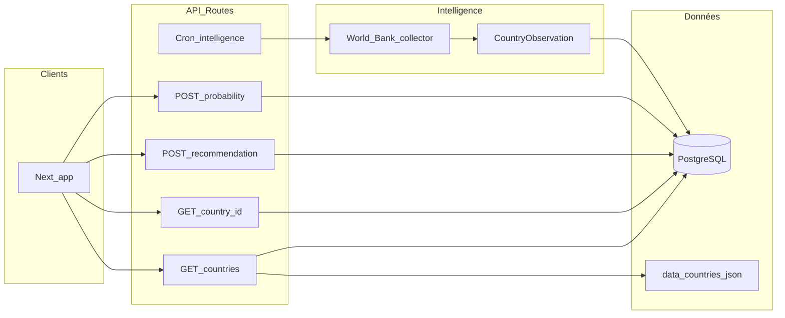

# Analyse du projet et 100 pistes d’amélioration

> **Emplacement :** ce fichier est la copie **versionnée** du catalogue (ouvrable depuis l’explorateur du projet).  
> Les tickets déjà priorisés / livrés sont résumés dans [engineering-prioritized-tickets.md](engineering-prioritized-tickets.md).

## Synthèse technique (état actuel)

- **Stack** : [package.json](../package.json) — Next 14, React 18, Prisma 6, Clerk, Tailwind, Recharts ; scripts `test:lib` (tsx), build avec validations Schengen + hero.
- **Données** : [prisma/schema.prisma](../prisma/schema.prisma) — `Country.full_data` (JSON string), scores visa en colonnes, `CountryObservation` + `IntelligenceSource` + `EnrichmentRun`, `CountryInsight`, profil utilisateur, favoris, historique, commentaires modérés, demandes déléguées.
- **APIs** : ~17 routes sous [app/api](../app/api) — pays (liste + détail), probabilité, recommandation, profil/favoris/historique, commentaires, admin, cron intelligence, etc.
- **Auth** : [proxy.ts](../proxy.ts) (middleware Clerk) protège dashboard (`/overview`, `/profile`, …), `/design-system` (interne), et endpoints sensibles (`/api/user/*`, admin…). Les pages **`/recommendations`** et **`/probability`** sont publiques : visiteurs = profil démo serveur ; connectés = profil en base.
- **Cœur métier** : merge statique + DB [lib/countries-prisma-merge.ts](../lib/countries-prisma-merge.ts), scoring [lib/scoring/](../lib/scoring/), pipeline [lib/intelligence-pipeline/](../lib/intelligence-pipeline/), agents [agents/runner.ts](../agents/runner.ts). **Doc moteurs** : [engine-probability-vs-recommendation.md](engine-probability-vs-recommendation.md) ; version `BABIL_ENGINE_VERSION` ([`lib/engine-version.ts`](../lib/engine-version.ts)) ; **transparence** : `topDrivers` ([`lib/score-driver-explain.ts`](../lib/score-driver-explain.ts) + i18n pilote [`lib/i18n/`](../lib/i18n/)), signaux fiche explicites ([`lib/probability-result-display.ts`](../lib/probability-result-display.ts)), journal `full_data` [`_data_changelog`](../lib/full-data-changelog.ts) (non exposé public), lexique échelles [`lib/score-scale-lexicon.ts`](../lib/score-scale-lexicon.ts).
- **Risques documentés** : payload `full_data` lourd sur listes ; croissance `CountryObservation` — voir [db-frontend-ux-audit.md](db-frontend-ux-audit.md), [country-observation-retention.md](country-observation-retention.md).

---

## Catalogue de 100 améliorations

### A — Produit et UX (1–22)

1. Page **historique** dédiée (liste filtrable des `UserHistoryEvent` au-delà du teaser overview).
2. **Export PDF** ou résumé imprimable d’une fiche pays (scores + signaux + disclaimer juridique).
3. **Mode comparaison** depuis le dashboard reco (sélection 2–3 pays sur le même écran que le radar).
4. **Tooltips** sur le radar reco expliquant chaque axe (définitions alignées avec le code).
5. **Cohérence linguistique** : relire tous les libellés FR/EN mélangés (ex. niveaux `Very High` vs traductions).
6. **Accessibilité** : contrastes, focus visible, `aria-*` sur repliables (provenance, insights DB, filtres).
7. **Responsive** : audit des grilles longues (fiche pays, compare) sur petits écrans.
8. **Skeleton loaders** au lieu de spinners seuls sur pages dashboard.
9. **Empty states** plus actionnables (liens profil, explorer, exemple de pays).
10. **Parcours onboarding** post-inscription (checklist profil + première recommandation).
11. **Notifications in-app** (toasts) sur succès/erreur favoris, commentaires, profil.
12. **Recherche pays** globale (cmd-k) branchée sur la liste fusionnée.
13. **Filtres sauvegardés** sur l’explorateur (localStorage ou profil).
14. **Partage social** / lien profond vers compare pré-rempli (query params documentés).
15. **Badge “données fraîches”** sur fiche si `economy_materialized_at` ou run intelligence récent.
16. **Section “sources officielles”** en tête de fiche (liens externes curated par pays).
17. **Carte monde** ou vue région interactive (heatmap score) — si pertinent produit.
18. **Parcours PhD** : CTA clair vers contenu structuré quand `hasPhdStudies`.
19. **Feedback utilisateur** (“utile / pas utile”) sur blocs explicatifs pour améliorer le produit.
20. **Personas** : presets de profil (étudiant, nomade, business) pour démo et tests.

> **Livré (lot A.16–A.20) :** section sources officielles [`lib/official-sources.ts`](../lib/official-sources.ts) + [`components/country/OfficialSourcesCard.tsx`](../components/country/OfficialSourcesCard.tsx) sur la fiche pays ; vue régionale type heatmap légère (moyennes par zone) [`ExplorerRegionScoreStrip`](../components/explorer/ExplorerRegionScoreStrip.tsx) + [`lib/explorer-region-score-buckets.ts`](../lib/explorer-region-score-buckets.ts) sur l’explorateur ; bandeau CTA PhD en tête de fiche + correctif dates intelligence (`intelLatest`) ; feedback « utile / pas utile » [`BlockFeedback`](../components/feedback/BlockFeedback.tsx) (localStorage + `CONTENT_FEEDBACK` via `POST /api/user/history` si connecté) ; personas démo sur [`app/(dashboard)/profile/page.tsx`](../app/(dashboard)/profile/page.tsx).

> **Livré (lot A.21–A.22) :** lecture sans compte sur [`/recommendations`](../app/(public)/recommendations/page.tsx), [`/probability`](../app/(public)/probability/page.tsx) et **[`/recommendation-engine`](../app/(public)/recommendation-engine/page.tsx)** (bac à sable invité avec `playground: true` + [`sanitizePublicSyntheticProfile`](../lib/public-synthetic-profile.ts)) ; profil démo [`PUBLIC_READ_ONLY_DEMO_PROFILE`](../lib/public-read-only-demo-profile.ts) sur les flux « liste » sans formulaire ; [`POST /api/recommendation`](../app/api/recommendation/route.ts) / [`POST /api/probability`](../app/api/probability/route.ts) ; design system [`/design-system`](../app/(dashboard)/design-system/page.tsx).

21. **Mode “lecture seule”** pour utilisateurs non connectés sur plus de routes si stratégie SEO l’exige.
22. **Storybook** ou page interne de design system (composants filtres, cartes, panneaux).

> **Livré (lot B.23–B.25) :** documentation unique [engine-probability-vs-recommendation.md](engine-probability-vs-recommendation.md) ; version des moteurs via `X-Babil-Engine-Version` / `X-Babil-Engine-Kind` et constante [`BABIL_ENGINE_VERSION`](../lib/engine-version.ts) ; tests de garde + checklist calibration dans la même doc ([`lib/public-synthetic-profile.test.ts`](../lib/public-synthetic-profile.test.ts)).

> **Livré (lot B.26–B.38 + C.39–C.52 + D.54–D.65) :** entrées détaillées en sections B, C et D (extrait). Synthèse pipeline + perf API : C.46–C.52, D.54–D.65 (OpenAPI, ETag pays, audit LCP home) — [api-edge-rate-limits.md](api-edge-rate-limits.md), [home-lcp-and-images.md](home-lcp-and-images.md).

> **Livré (lot E.66–E.77) :** [catalogue-e-security.md](catalogue-e-security.md) — RBAC admin (tests), **E.67** audit admin, **E.68** Origin mutations prod, **E.71** erreurs API (`api-public-error`), **E.72–E.75** (modération, checklists at rest / DPA, tests scope + délégué), **E.76** webhook signé (`/api/webhooks/ingest`), en-têtes sécurité + HSTS, **E.77** `audit:ci` + Dependabot, **Clerk 6** + middleware `auth.protect()` sur routes protégées.

### B — Données, scoring et transparence (23–38)

23. **Documenter formules** probabilité vs recommandation dans un seul doc technique (poids, inputs).
24. **Versionner** les moteurs (`engineVersion` dans les réponses API) pour audits et régressions.
25. **Calibration** : backtests sur jeux de pays “connus” + métriques de stabilité.
26. **Explications SHAP-like simplifiées** (top 3 facteurs qui ont bougé le score).
27. **Aligner** les échelles 1–10 vs 0–100 partout (naming dans Prisma vs UI).
28. **Journal des changements** `full_data` (qui a écrit quoi, quand) — au-delà des observations.
29. **Valider** cohérence `country-intelligence-contract` vs champs réellement affichés (snapshot CI).
30. **Signaux manquants** : afficher “non renseigné” vs implicite 50 par défaut (UX honnête).
31. **Score de confiance global** par pays (agrégat des `confidence` observations).
32. **Détection d’anomalies** (PIB/pop incohérents, sauts brutaux entre runs).
33. **Harmoniser** `CountryInsight` vs observations (stratégie de convergence ou dépréciation).
34. **Enrichir** `goal_type` avec validation stricte côté API (enum partagé front/back).
35. **Profil** : validation `profession` par enum au lieu de string libre.
36. **Champs sensibles** `DelegatedApplicationRequest` : masquage partiel dans logs et UI admin.
37. **Export données RGPD** pour l’utilisateur (pack JSON des tables le concernant).
38. **Stratégie i18n** des chaînes métier (clés, pas concaténation ad hoc).

### C — Pipeline intelligence et observations (39–52)

39. **Politique de rétention** `CountryObservation` (TTL, archive cold storage, agrégation par trimestre). *(Livré : doc + script purge + workflow CI dry-run — voir [country-observation-retention.md](country-observation-retention.md). Agrégation trimestrielle / cold storage : backlog.)*
40. Job **compaction** : garder dernière observation par `(countryId, fieldPath, source)` + historique optionnel. *(Livré : [`scripts/compact-country-observations.ts`](../scripts/compact-country-observations.ts) avec `--export-json` optionnel.)*
41. **Dashboard admin** : volume par source, par pays, par run. *(Livré : API + onglet Intelligence sur `/admin`.)*
42. **Alerting** si run `EnrichmentRun` échoue ou stagne en `PENDING`. *(Livré : `runAlerts` sur l’API admin, bandeau Intelligence, script + workflow CI — [enrichment-run-alerts.md](enrichment-run-alerts.md).)*
43. **Idempotence** renforcée des collecteurs WB (clé métier claire, reprises). *(Livré : `dedupeKey` unique + upsert — [`world-bank-dedupe.ts`](../lib/intelligence-pipeline/world-bank-dedupe.ts), migration Prisma.)*
44. **Sources additionnelles** (OECD, IMF, UN) derrière même abstraction `IntelligenceSource`. *(Livré : stubs enregistrés + `--stub-collectors` — [`stub-multilateral-collectors.ts`](../lib/intelligence-pipeline/stub-multilateral-collectors.ts) ; connecteurs HTTP : backlog.)*
45. **File d’attente** async (queue) si collecte dépasse timeout serverless. *(Livré : `IntelligencePipelineJob`, scripts enqueue/worker, doc [intelligence-pipeline-queue.md](intelligence-pipeline-queue.md), KPIs admin.)*
46. **Tests d’intégration** mock HTTP sur collecteurs (contrats JSON stables). *(Livré : [`world-bank-client.integration.test.ts`](../lib/intelligence-pipeline/world-bank-client.integration.test.ts) — mock `fetch`, corps `[meta, rows]` World Bank.)*
47. **Seed sources** documenté et reproductible sur nouvelle base. *(Livré : [intelligence-seed-sources.md](intelligence-seed-sources.md) + commande `npm run intelligence:seed-sources`.)*
48. **Materialisation** : étendre au-delà économie/santé/travail (taxonomie [lib/intelligence-pipeline/taxonomy-v1.ts](../lib/intelligence-pipeline/taxonomy-v1.ts)). *(Livré partiel : indicateur **population urbaine %** (`SP.URB.TOTL.IN.ZS` → `demographics.urban_population_pct` → `full_data.demographics.urban_population_wb_pct`) ; autres domaines : backlog.)*
49. **Provenance utilisateur** : lien depuis UI vers explication du `fieldPath` (glossaire). *(Livré : page [`/intelligence-fieldpaths`](../app/(public)/intelligence-fieldpaths/page.tsx) + lien depuis [`IntelligenceProvenanceCollapsible`](../components/country/IntelligenceProvenanceCollapsible.tsx) + module [`lib/intelligence-fieldpath-glossary.ts`](../lib/intelligence-fieldpath-glossary.ts).)*
50. **Limiter** `rawPayload` taille ou externaliser vers object storage si croissance. *(Livré : plafond bytes [`observation-raw-payload.ts`](../lib/intelligence-pipeline/observation-raw-payload.ts) appliqué dans [`world-bank-collector.ts`](../lib/intelligence-pipeline/world-bank-collector.ts) ; object storage : backlog si besoin.)*
51. **Cron** : documenter secrets, environnements, et rollback si matérialisation partielle. *(Livré : [intelligence-cron-and-environments.md](intelligence-cron-and-environments.md).)*
52. **Feature flag** pour activer/désactiver collecte par source en prod. *(Livré : `INTELLIGENCE_SOURCE_DISABLED_SLUGS` + [`source-collection-flags.ts`](../lib/intelligence-pipeline/source-collection-flags.ts), appliqué au collecteur WB et aux stubs multilatéraux — voir doc cron.)*

> **Livré (lot D.54–D.65) :** pagination curseur + cache HTTP liste/fiche ; `unstable_cache` liste fusionnée + `revalidateTag` admin ; D.58–D.60 — [`proxy.ts`](../proxy.ts) + [api-edge-rate-limits.md](api-edge-rate-limits.md) ; **D.61–D.62** — timeout WB + Zod POST reco/proba ; **D.63** — spec [openapi/babil-public-api.yaml](openapi/babil-public-api.yaml) + `GET /api/openapi` ; **D.64** — ETag faible + `If-None-Match` → 304 sur `GET /api/countries` et `GET /api/countries/[id]` ([`json-response-with-etag.ts`](../lib/json-response-with-etag.ts)) ; **D.65** — audit LCP hero [home-lcp-and-images.md](home-lcp-and-images.md).

### D — API, performances et cache (53–65)

53. **`GET /api/countries?light=1`** : exclure ou tronquer `full_data` + commentaires pour listes. *(Livré.)*
54. **Pagination / curseur** sur liste pays si le nombre de pays augmente fortement. *(Livré : `GET /api/countries?limit=1..200` + `cursor` = dernier `id` exclus ; enveloppe `{ items, nextCursor, hasMore }` ; sans `limit` le corps reste un tableau — voir JSDoc [`route.ts`](../app/api/countries/route.ts).)*
55. **`Cache-Control`** / `stale-while-revalidate` sur réponses publiques sûres. *(Livré : [`lib/public-api-cache.ts`](../lib/public-api-cache.ts) sur `GET /api/countries` et `GET /api/countries/[id]`.)*
56. **React `cache()`** ou équivalent déjà partiellement utilisé — étendre aux lectures lourdes répétées. *(Livré : `unstable_cache` (120s, tag `babil-merged-countries-list`) + `cache()` sur [`getMergedCountriesListCached`](../lib/countries-prisma-merge.ts) ; `buildMergedCountriesList` délègue à ce chemin.)*
57. **Déduplication** des appels `buildMergedCountriesList` dans une même requête (si patterns N+1). *(Livré : même module — `cache()` pour un rendu / handler ; invalidation `revalidateTag` sur [`PATCH /api/admin/countries/[id]`](../app/api/admin/countries/[id]/route.ts).)*
58. **Edge** : évaluer middleware géo ou redirections uniquement (pas de logique lourde). *(Livré : commentaire architecture [`proxy.ts`](../proxy.ts) + synthèse [api-edge-rate-limits.md](api-edge-rate-limits.md) — middleware = auth Clerk uniquement, pas de géo/DB.)*
59. **Compression** Brotli côté plateforme (souvent auto) + vérifier taille JSON max. *(Livré : doc plateforme + plafond `Content-Length` sur POST reco/proba [`engine-post-body-limits.ts`](../lib/engine-post-body-limits.ts), variable `BABIL_ENGINE_POST_MAX_CONTENT_LENGTH`.)*
60. **Rate limiting** par `userId` sur POST reco/proba pour anti-abus. *(Livré : [`engine-post-rate-limit.ts`](../lib/engine-post-rate-limit.ts) — clé `user:` / `anon:` + IP ; 429 + `Retry-After` ; env `BABIL_ENGINE_RATE_LIMIT_*`.)*
61. **Timeouts** explicites sur appels externes dans pipeline (éviter hangs). *(Livré : [`intelligencePipelineFetch`](../lib/intelligence-pipeline/http-fetch.ts) sur [`world-bank-client.ts`](../lib/intelligence-pipeline/world-bank-client.ts) ; `INTELLIGENCE_HTTP_TIMEOUT_MS` — voir [intelligence-cron-and-environments.md](intelligence-cron-and-environments.md).)*
62. **Validation Zod** (ou équivalent) sur bodies API publiques/admin. *(Livré partiel : Zod sur **`POST /api/recommendation`** et **`POST /api/probability`** — [`reco-proba-post-body.ts`](../lib/api-schemas/reco-proba-post-body.ts) ; autres routes : backlog.)*
63. **OpenAPI** spec générée ou maintenue pour les routes API. *(Livré : [`docs/openapi/babil-public-api.yaml`](openapi/babil-public-api.yaml) + exposition `GET /api/openapi` — voir [api-edge-rate-limits.md](api-edge-rate-limits.md).)*
64. **ETag** sur ressources pays statiques/fallback si applicable. *(Livré : ETag faible (hash JSON) sur **`GET /api/countries`** et **`GET /api/countries/[id]`** ; `If-None-Match` → **304** — [`lib/json-response-with-etag.ts`](../lib/json-response-with-etag.ts).)*
65. **Image / assets** : audit `next/image` et poids LCP sur home. *(Livré : doc [home-lcp-and-images.md](home-lcp-and-images.md) — hero `HeroWorldCarousel` déjà `priority` + `sizes` ; optimisations multi-calques : backlog.)*

### E — Sécurité, conformité et admin (66–77)

66. Revue **RBAC** : s’assurer que toutes les routes `/api/admin/*` vérifient `Role.ADMIN` côté serveur. *(Livré : garde [`lib/admin-api-routes.test.ts`](../lib/admin-api-routes.test.ts) + `getAdminUser` sur chaque route admin — voir [catalogue-e-security.md](catalogue-e-security.md).)*
67. **Audit log** des actions admin (modifs pays, statuts demandes déléguées). *(Livré : modèle `AdminAuditLog`, [`recordAdminAudit`](../lib/admin-audit-log.ts), `GET /api/admin/audit-log`, câblage PATCH pays + demandes déléguées — [catalogue-e-security.md](catalogue-e-security.md) §E.67.)*
68. **CSRF** / origin checks sur routes sensibles si cookies non SameSite strict partout. *(Livré partiel : garde **production** `Origin`/`Referer` sur mutations — [`lib/mutation-origin-guard.ts`](../lib/mutation-origin-guard.ts) ; voir [catalogue-e-security.md](catalogue-e-security.md) §E.68.)*
69. **Headers sécurité** (CSP, HSTS) via Next config. *(Livré partiel : en-têtes baseline + HSTS en prod dans [`next.config.js`](../next.config.js) ; CSP stricte : backlog — [catalogue-e-security.md](catalogue-e-security.md).)*
70. **Secrets** : rotation `CRON_SECRET`, pas de fuite dans logs GitHub Actions. *(Livré partiel : pratiques documentées [catalogue-e-security.md](catalogue-e-security.md) ; rotation = process hors repo.)*
71. **Scrub** PII dans `errorSummary` / stack traces exposées au client. *(Livré : [`lib/api-public-error.ts`](../lib/api-public-error.ts) — `publicApiErrorMessage` / `scrubSensitiveClientText` sur réponses 5xx API ; détail admin intelligence + erreurs agents — [catalogue-e-security.md](catalogue-e-security.md) §E.71.)*
72. **Modération commentaires** : file d’attente avec raccourcis anti-spam (rate limit). *(Livré partiel : rate limit **soumission** `POST /api/comments` — [`comment-post-rate-limit.ts`](../lib/comment-post-rate-limit.ts) ; file d’attente `PENDING` + actions Approuver/Refuser/Supprimer ; bouton **Actualiser** sur [`/moderation`](../app/(dashboard)/moderation/page.tsx) ; raccourcis bulk / E2E : backlog.)*
73. **Chiffrement at rest** : vérifier politique hébergeur DB + sauvegardes. *(Livré partiel : checklist étendue [catalogue-e-security.md](catalogue-e-security.md) §E.73 — Neon / Render / rétention ; validation légale hors code.)*
74. **DPA / sous-traitants** (Clerk, hébergeur) documentés pour conformité. *(Livré partiel : registre processors §E.74 dans [catalogue-e-security.md](catalogue-e-security.md) ; contrats signés = hors repo.)*
75. **Tests d’autorisation** (utilisateur A ne lit pas données B) sur favoris/historique. *(Livré : garde [`user-private-api-scope.test.ts`](../lib/user-private-api-scope.test.ts) — favoris, historique, export RGPD, **demandes déléguées** (liste + détail) ; pas de `userId` client dans query/body ; tests E2E multi-comptes : backlog.)*
76. **Webhook** sécurisé si intégrations tierces (signature). *(Livré : HMAC-SHA256 + [`POST /api/webhooks/ingest`](../app/api/webhooks/ingest/route.ts) — [`lib/webhook-signature.ts`](../lib/webhook-signature.ts), [`lib/webhook-ingest-dispatch.ts`](../lib/webhook-ingest-dispatch.ts) (`ping`, `intelligence.pipeline.run` + `mode`), `BABIL_WEBHOOK_INGEST_SECRET` — [catalogue-e-security.md](catalogue-e-security.md) §E.76.)*
77. **Dependency audit** : `npm audit` en CI + Dependabot. *(Livré : `npm run audit:ci` dans [ci.yml](../.github/workflows/ci.yml) + [dependabot.yml](../.github/dependabot.yml) — [catalogue-e-security.md](catalogue-e-security.md).)*

### F — Qualité code, tests et DX (78–88)

78. Ajouter **vitest** (ou **playwright**) en devDependency aligné avec `npm run test:lib`. *(Livré : **Vitest** + [`vitest.config.ts`](../vitest.config.ts), script `npm run test:vitest` ; `npm run check` et [ci.yml](../.github/workflows/ci.yml) exécutent `test:lib` puis `test:vitest`.)*
79. **Couverture** minimale sur routes API critiques (reco, proba, pays). *(Livré partiel : [`lib/api-routes-critical.vitest.ts`](../lib/api-routes-critical.vitest.ts) — GET pays, POST reco/proba 200/400 avec merge mocké ; E2E Playwright : backlog.)*
80. Réduire **`any`** dans [app/api/recommendation/route.ts](../app/api/recommendation/route.ts) et [app/api/probability/route.ts](../app/api/probability/route.ts). *(Livré : typage `RecoProbaPostBody`, [`EngineCountryListRow`](../lib/types/engine-country-list-row.ts), helpers sans `any`.)*
81. **ESLint stricter** (`no-explicit-any`, import order) progressivement. *(Livré partiel : `@typescript-eslint/no-explicit-any`: warn ; **`eslint-plugin-import`** + **`import/order`: warn** + passage **`next lint --fix`** pour normaliser l’ordre des imports ; typage **`CountryApiListRow`** + retraits de **`any`** sur pages publiques / modération / explorer / éducation / Schengen / fiche pays — **`npm run lint`** sans warnings sur l’état actuel.)*
82. **Types partagés** `ApiRecommendation` / probabilité dans `lib/types/` unique. *(Livré : [`lib/types/api-recommendation-probability.ts`](../lib/types/api-recommendation-probability.ts), [`lib/types/engine-country-list-row.ts`](../lib/types/engine-country-list-row.ts), **barrel** [`lib/types/index.ts`](../lib/types/index.ts) — ex. `import type { ProbabilityApiRow } from '@/lib/types'`.)*
83. **Prettier** + format CI pour éviter drift CRLF/LF. *(Livré partiel : Prettier + CI ; périmètre étendu à **`agents/**/*.ts`**, [`app/error.tsx`](../app/error.tsx), [`app/(dashboard)/error.tsx`](../app/(dashboard)/error.tsx), en plus de `app/api/**`, `lib/types/**`, `lib/api-schemas/**`.)*
84. **Architecture** : scinder `agents/runner.ts` si > seuil de maintenabilité (modules par étape). *(Livré partiel : [`agents/runner-types.ts`](../agents/runner-types.ts), [`agents/runner-constants.ts`](../agents/runner-constants.ts), [`agents/runner-persistence.ts`](../agents/runner-persistence.ts), [`agents/runner-schedule-seeds.ts`](../agents/runner-schedule-seeds.ts) ; orchestration dans [`agents/runner.ts`](../agents/runner.ts).)*
85. **Dead code** : inventaire `server.js` / scripts legacy vs App Router. *(Livré : [`docs/dead-code-and-legacy.md`](dead-code-and-legacy.md) — `server.js`, deps Express, **`package.json` / `main` orphelin**, scripts npm.)*
86. **Error boundaries** React sur layouts dashboard/public. *(Livré : [`app/error.tsx`](../app/error.tsx), [`app/global-error.tsx`](../app/global-error.tsx), [`app/(dashboard)/error.tsx`](../app/(dashboard)/error.tsx) — boundaries App Router + rapport Sentry optionnel sur erreurs capturées — G.90.)*
87. **Convention** fichiers client/server (`'use client'` minimal). *(Livré : section README [Conventions App Router](../README.md#conventions-app-router).)*
88. **README** développeur : variables d’environnement, ordre `db:setup`, intelligence pipeline. *(Livré : [`README.md`](../README.md) à la racine.)*

### G — DevOps, observabilité et coûts (89–96)

89. **CI GitHub Actions** : lint + `test:lib` + build sur chaque PR (en plus du cron intelligence). *(Livré : `.github/workflows/ci.yml`.)*
90. **Sentry** (ou équivalent) front + API avec contexte utilisateur anonymisé. *(Livré partiel : **`@sentry/nextjs`** + [`next.config.js`](../next.config.js) (`withSentryConfig`, `instrumentationHook`), [`instrumentation.ts`](../instrumentation.ts), [`sentry.client.config.ts`](../sentry.client.config.ts) / [`sentry.server.config.ts`](../sentry.server.config.ts) / [`sentry.edge.config.ts`](../sentry.edge.config.ts), [`components/SentryClerkSync.tsx`](../components/SentryClerkSync.tsx) + [`lib/sentry-anon-user-id.ts`](../lib/sentry-anon-user-id.ts), capture dans les `error.tsx` ; configurer `NEXT_PUBLIC_SENTRY_DSN` en prod — voir README / `.env.example`.)*
91. **Logs structurés** (JSON) pour Vercel/server avec corrélation `requestId`. *(Livré partiel : en-tête **`x-babil-request-id`** + log JSON **`api_request`** sur `/api/*` dans [`proxy.ts`](../proxy.ts) ; helpers [`lib/structured-log.ts`](../lib/structured-log.ts) + exemple erreur [`GET /api/countries`](../app/api/countries/route.ts) ; variables `BABIL_API_ACCESS_LOG` — voir README / `.env.example`.)*
92. **Métriques** : latence p95 des routes pays / reco / proba.
93. **Budget** : alerte coût si agents OpenAI / appels externes augmentent.
94. **Environnements** : preview DB séparée ou feature branch Neon.
95. **Runbooks** incident (pipeline cassé, DB down, fallback static).
96. **Healthcheck** unifié (`/api/admin/agents/health` déjà présent — documenter dépendances).

### H — Agents, contenu et croissance (97–100)

97. **Garde-fous** agents : plafond tokens, retries, sortie schema-validée vers `full_data`.
98. **Manifest** agents ([data/agent-manifest-url-map.scaffold.json](../data/agent-manifest-url-map.scaffold.json)) — process review humain avant prod.
99. **SEO** : métadonnées dynamiques pays (déjà partiel [app/(public)/countries/[id]/layout.tsx](../app/(public)/countries/[id]/layout.tsx)) + données structurées FAQ/HowTo si pertinent.
100. **Monétisation** (aligné [docs/business-commercial-analysis.md](business-commercial-analysis.md)) : offres “rapport approfondi” branchées sur données déjà collectées (sans sur-collecte).

---

## Prochaine étape recommandée

Prioriser **3–5 items** à fort impact / faible risque : par ex. **92** (métriques p95), **poursuite F.84** (extraire d’autres modules depuis `runner.ts`), extension **Prettier** hors périmètre actuel.
