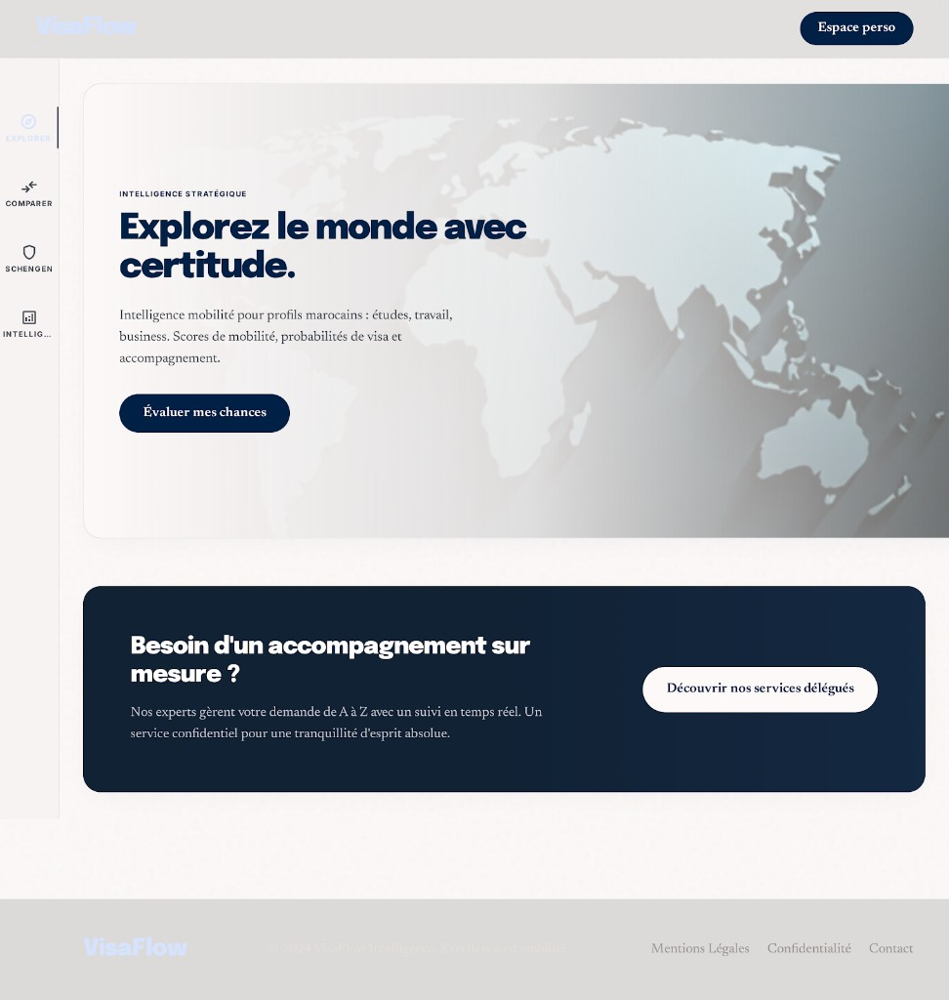

# PAGE 01 — “MERIDIAN”
## Accueil VisaFlow — landing intelligence mobilité

### File Name
`01-meridian-home-landing.md`

### Page Type
Authenticated (shell Nexus PAGE 35) — contenu accueil dans le slot `#dashboard-content`

### Related User Journeys
- Découverte organique / SEO
- Première impression marque
- Entrée vers Explorer ou Compare selon objectif

### Connected Pages
- **Précédent :** sources externes, campagnes
- **Suivant :** `/explorer`, `/compare`, `/countries/[id]`, `/overview` (Espace perso)

---

## 1. Page Purpose
L’accueil **ancre la promesse VisaFlow** : mobilité internationale pour profils marocains avec scores, friction, études, business. Elle résout *“Par où commencer ?”* en combinant **hero émotionnel**, **filtres rapides**, **pays vitrines** et **preuve de profondeur** (données + parcours). Objectif business : augmenter l’exploration qualifiée et pousser vers moteurs (probabilité, reco) sans submerger.

---

## 2. Primary User Actions
- **Primaires :** lancer exploration objectif-aware ; ouvrir un pays vitrine ; utiliser filtres rapides du hero.
- **Secondaires :** lire slides hero ; défiler carrousel monde.
- **Engagement :** cliquer comparer / Schengen depuis modules secondaires (si présents dans `HomeExperience`).
- **Conversion :** navigation sidebar Nexus (Accueil, Explorer, probabilités) ; auth Clerk requise (`/` protégé middleware).

---

## 3. UX Goals
- **Émotion :** inspiration contrôlée (aspiration voyagée, pas “influence” creuse).
- **Confiance :** montrer densité informationnelle sans jargon initial.
- **Clarté :** hiérarchie lecture F — kicker → titre → sous-texte → action.
- **Friction réduite :** un seul niveau de décision avant la grille pays.

---

## 4. Layout Architecture
**Racine (`app/page.tsx`) :** RSC `force-dynamic` ; `Promise.all` → `resolveHomeShowcaseCountries()` + `buildHomeHeroSlides()` passés au client **`HomeExperience`** (`components/home/HomeExperience.tsx`).

**Dans `HomeExperience` (ordre macro — code 2026-05-14, refonte Stitch) :**
1. **Hero éditorial single-column** — fond crème `#FDF8EF`, carte blanche `rounded-[2rem]`, **carte monde inline SVG** floutée (opacity ~8.5 %) en fond de droite, **gradient blanc-vers-transparent** sur 2/3 gauche pour garantir le contraste, **kicker mono uppercase** (`heroCopy.badge`), **titre serif Fraunces** (`clamp(2.5rem,5vw,3.75rem)`), sous-texte, **CTA primaire navy pill** `Évaluer mes chances` (→ `/probability`), **CTA secondaire texte** `Ouvrir l'Explorer`, **ligne de garanties** mono : `Sources officielles · Méthodologie ouverte · Mis à jour en continu`.
2. **Bandeau priorités** (`focusStripForObjective`) — carte blanche + chips crème `#F5F0E3`.
3. **`HomeQuickFilterEngine`**.
4. **`DelegatedApplicationsHomePromo`** (`variant="meridianBanner"`, bandeau bleu nuit `#0a1f33` + CTA blanc).
5. **Section « Destinations vérifiées »** — header éditorial + **`HeroWorldCarousel`** (déplacé hors du hero).
6. **Section « Pays à la une »** — header éditorial + **`CountryGrid`** (`topCountries`).
7. **Section « Modules VisaFlow »** — `FEATURE_MAP` / `homeFeatureOrderForObjective` ; tuiles crème, icône navy dans cube blanc, micro-CTA *Ouvrir* en hover.
8. **Section « Retours après utilisation »** — 3 témoignages, blockquote serif.
9. **Section « Bonnes pratiques »** — 4 étapes numérotées.
10. **`GoogleAd`** (`home_top`).
11. **PAS de footer local** — délégué au **`SiteFooter`** global (**PAGE 43** / **PAGE 36** quand routé).

**Tokens couleur :** `INK = #0D1B3E` (texte/CTA), `INK_60` `INK_45` `INK_10` pour hiérarchie, `CREAM_BG = #FDF8EF` (fond page), `CREAM_PANEL = #F5F0E3` (chips & nested panels).

**Typographie (PAGE 33 family) :**
- **Sans** Inter via `next/font` (`var(--font-sans)`) — corps & boutons.
- **Serif** Fraunces variable via `next/font` (`var(--font-serif)`) — `h1` hero + `h2` sections + `headerTitle` Clerk.
- **Mono** JetBrains Mono via `next/font` (`var(--font-mono)`) — kickers, garanties, micro-CTA.

**Chrome global :** header / rail dock / footer = **PAGE 34**–**PAGE 45** (pas redocumentés ici).

**Maquette Stitch de référence :** capture **`../assets/page-01-meridian-stitch-reference.png`**.

### 4bis. Écart maquette ↔ implémentation (réconcilié 2026-05-14)
**État code (post-refonte) :** la home **épouse désormais le visuel Stitch** : fond crème (`#FDF8EF`), hero single-column avec carte monde fade et **un seul** CTA primaire navy, bandeau bleu nuit aligné, **plus de double footer** (seul `SiteFooter` global reste). Le bloc « Destinations » réintroduit `HeroWorldCarousel` comme **valeur supplémentaire** sous le bandeau (au-delà de la simplicité Stitch, on garde l'utilité produit).

| Zone | Maquette (capture) | Code `HomeExperience` (refonte 2026-05-14) |
|------|--------------------|---------------------------------------------|
| Fond page | Crème ivoire | `#FDF8EF` (`CREAM_BG`) — **aligné** |
| Hero layout | Single-column, carte monde en fond | Single-column, world map SVG inline, gradient blanc gauche — **aligné** |
| Hero typographie | Serif éditorial gras | **Fraunces** via `next/font` (chargé en `--font-serif`) — **aligné** |
| Kicker | `INTELLIGENCE STRATÉGIQUE` mono | `heroCopy.badge` rendu en **JetBrains Mono** — **aligné** |
| CTA primaire | Pill navy unique *Évaluer mes chances* | `/probability`, rounded-full, `#0D1B3E` — **aligné** ; CTA secondaire conservé en lien texte discret |
| Bandeau services | Bleu nuit plein largeur + CTA blanc | `DelegatedApplicationsHomePromo` `variant="meridianBanner"` — **aligné** |
| Sections « depth » | (absentes — Stitch est minimal) | **Conservées** sous le bandeau (priorités, filtres, destinations, grille pays, modules, témoignages, bonnes pratiques) — décision produit : garder la valeur SEO/utilité sous la fold |
| Footer | Slim row (Mentions / Confidentialité / Contact) | **`SiteFooter` global uniquement** — **aligné** ; le footer local 4-col a été retiré |

**Responsive :** hero stack ; filtres chips scroll horizontal ; grille pays 1 col mobile.

---

## 5. Full Section Breakdown

### 5.0 Métadonnées & SEO (`metadata` dans `page.tsx`)
- **Title / description** : promesse mobilité + filtres (aligné produit).

### 5.1 Navbar (global)
- **Implémentation :** **`SiteHeader`** (**PAGE 43**) — logo, **`GlobalCountrySearch`** (**PAGE 45**), Connexion / Tableau de bord ; rail **`SitePrimaryNavColumn`** (**PAGE 44**) hors zone `HomeExperience`.
- **Maquette PAGE 01 :** CTA unique **Espace perso** en haut à droite — vérifier cohérence avec états **SignedIn** / **SignedOut** réels.

### 5.2 Hero
- **Purpose :** émotion + promesse en une phrase (`heroCopy` + `HeroWorldCarousel`).
- **Animations :** carrousel monde — transition slide douce ; cross-fade texte ; respect reduced-motion = cut instantané.
- **Visual importance :** dominant LCP — optimiser médias.
- **Alignement maquette :** si le copywriting figé *INTELLIGENCE STRATÉGIQUE* / *Explorez le monde avec certitude.* est repris, le mapper dans **`homeHeroForObjective`** (ou variante par défaut) pour une seule source de vérité.

### 5.3 Quick filters / mini-engine
- **Purpose :** activation immédiate sans aller à l’explorer complet.
- **Interactions :** changement objectif met à jour liens compare/explore (pattern `ObjectivePreferenceProvider`).
- **Empty states :** si aucun pays résolu : message + CTA explorer sans filtre.

### 5.4 Showcase grid
- **Purpose :** preuve sociale de données (cartes pays).
- **Skeletons :** shimmer cards alignées grille finale.
- **Pagination :** scroll infini déconseillé pour SEO — préférer “Voir plus” vers explorer.

### 5.5 Rubrique “features” objectif-aware
- **Purpose :** liens rapides (probabilité, Schengen, Assist, éducation, communauté, business, investissement, etc.) via `FEATURE_MAP` + ordre `homeFeatureOrderForObjective`.
- **CTA :** `href` fixes ou dérivés (`/probability`, `/schengen`, …).

### 5.6 Bandeau focus objectif (`focusStripForObjective` / `homeHeroForObjective`)
- **Purpose :** renforcer la cohérence avec `ObjectivePreferenceProvider` (slug primaire).

### 5.7 `DelegatedApplicationsHomePromo`
- **Purpose :** pont conversion vers **PAGE 20** sans alourdir le hero.
- **Maquette :** bandeau **plein pied** bleu nuit + CTA inversé — si adopté visuellement, garder le même ordre d’apparition **après** filtres ou **après** grille (décision UX) et vérifier contraste WCAG sur texte blanc.

### 5.8 `GoogleAd`
- **Purpose :** slot régie — ne pas intercaler entre CTA critique et grille pays.

### 5.9 `AppSidebar` + `PageContainer`
- **Purpose :** raccourcis navigation objectif-aware dans une **carte** sous la grille pays (pas le rail global **PAGE 44**).
- **Stitch :** la maquette **§4bis** montre un rail **réduit** ; soit on rapproche l’UI code (section dédiée en haut), soit on documente ce sidebar comme **secondaire** pour ne pas dupliquer le rail.

---

## 6. UI Design Direction
- **Prod actuelle :** palette chaude **papier ivoire** (`#fdf8ef` feel), **primary** sur CTA, ombres `shadow-soft` / `shadow-card`. Typographie **noir chaud** (`text-text`) et **muted** pour méta. Coins `rounded-2xl` sur modules.
- **Maquette capture (Stitch) :** fond **gris très clair**, **bleu nuit** (#0A1F33 ordre de grandeur) pour hero CTA et bandeau services ; logo **bleu clair** sur header/footer ; arrondis généreux (~16–20px). Utiliser cette direction pour **nouvelles** itérations Stitch ; fusion avec tokens chauds = décision design system explicite.

---

## 7. Interaction Design
Scroll : parallax léger hero optionnel. Clic carte pays : ripple subtil + navigation Next. Keyboard : `Tab` traverse filtres puis grille ordonnée DOM.

---

## 8. Responsive UX
- **Desktop :** hero split possible texte / visuel.
- **Tablet :** hero full width, filtres 2 lignes.
- **Mobile :** filtres chips scroll horizontal ; cartes 1 colonne.

---

## 9. Accessibility
Contraste titres ; `aria-live="polite"` sur changement de slide si auto-play ; pause auto-play visible ; images hero `alt` descriptifs contextualisés.

---

## 10. Edge Cases & States
- **Loading :** skeleton hero + skeleton grid.
- **Empty :** pays vitrines indisponibles → message + lien explorer.
- **Error :** boundary parent — message générique + reload.

---

## 11. User Journey Connections
**Entrées :** SEO, partage lien. **Sorties :** explorer, compare, fiche pays, espace perso. **Conversion :** premier clic objectif. **Rétention :** favoriser sign-in après 2e interaction (pattern futur).

---

## 12. AI DESIGN INSTRUCTIONS FOR STITCH
- **Référence visuelle livrée :** reproduire la **hiérarchie** et le **contraste** de `../assets/page-01-meridian-stitch-reference.png` (hero lisible, bandeau services distinct, footer léger).
- **Au-delà de la capture :** hero **cinématographique minimal** (cartes géo abstraites, grain léger). Filtres comme **instrument de précision** (glass chips). Grille pays : **cartes premium** (drapeau, score barre douce). Ambiance **“research terminal luxe”** — jamais start-up criarde.
- **Légal :** lorsque **PAGE 36** sera routée, aligner les liens footer de la maquette sur les vraies URLs.

---

## 13. Screenshot reference (Stitch)

### Stitch Screenshot Reference — PAGE 01 (MERIDIAN)

*Capture intégrée au dépôt pour briefing stable ; voir **§4bis** pour les écarts avec `HomeExperience`.*
