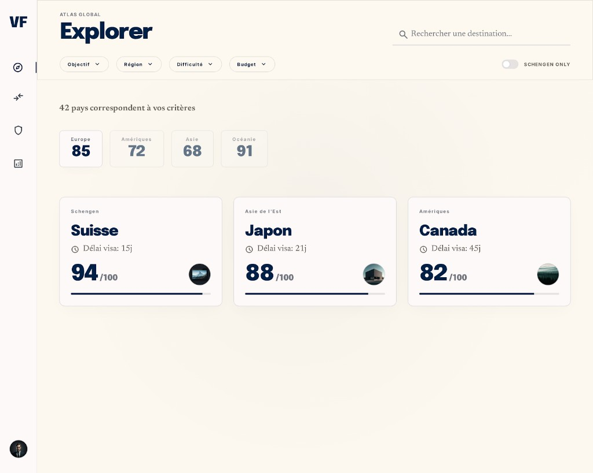

# PAGE 02 — “ATLAS”
## Explorer global — découverte pays par objectifs et filtres

### File Name
`02-atlas-global-explorer.md`

### Page Type
Public (accessible aussi depuis shell dashboard via navigation explorateur)

### Related User Journeys
- Exploration large puis affinage
- Préparation comparaison multi-pays
- Découverte Schengen adjacente (lien nav)

### Connected Pages
- **Précédent :** `/`, objectif préféré cross-pages
- **Suivant :** `/countries/[id]`, `/compare`, `/schengen`

---

## 1. Page Purpose
L’explorer est le **cœur de découverte transactionnelle** : l’utilisateur transforme intention (objectif, budget, région, risque) en **liste pays qualifiée**. Il résout *“Quelles destinations matchent mes contraintes ?”* Objectif business : augmenter profondeur de session et clics vers fiches pays.

---

## 2. Primary User Actions
- **Primaires :** modifier filtres ; ouvrir fiche pays ; réinitialiser filtres.
- **Secondaires :** trier / réordonner si UI le permet ; basculer vue grille.
- **Engagement :** sauvegarder filtres (si implémenté côté client / futur compte).
- **Conversion :** auth pour favoris / historique (patterns futurs alignés reco).

---

## 3. UX Goals
- **Contrôle perçu :** chaque filtre a un feedback immédiat sur le nombre de résultats.
- **Progressive disclosure :** filtres avancés repliables.
- **Confiance :** afficher hint “sources & scores” liant vers provenance pays.

---

## 4. Layout Architecture
**Fichier :** `app/(public)/explorer/page.tsx` — **`Suspense`** (spinner) → **`ExplorerPageInner`** (`useSearchParams`, `useRouter` ; **URL = source de vérité** après navigation).

**Maquette Stitch de référence :** capture **`../assets/page-02-atlas-stitch-reference.png`** — voir **§4bis** pour écarts résiduels.

**En-tête (Atlas) :** kicker *ATLAS GLOBAL*, titre *Explorer*, recherche à droite (placeholder *Rechercher une destination…*), fond page **`#FDFBF4`**.

**Bandeau sticky** (`top-16`, blur) : **`FilterBar`** (objectif + région, incl. Océanie) + **SCHENGEN ONLY** ; ligne suivante : toggle **Liste / Recommandation**, **`Comparer`**, selects **difficulté** + **budget**, **Mémoriser / Restaurer / Oublier** (`lib/explorer-saved-filters`, toasts).

**Corps :** ligne *N pays correspondent à vos critères* (`aria-live`) → **`ExplorerRegionScoreStrip`** `variant="atlas"` (tuiles Europe / Amériques / Asie / Océanie) → **`GoogleAd`** `explorer_top` → **`CountryGrid`** `cardVariant="atlas"` → `explorer_bottom`.

### 4bis. Écart maquette ↔ implémentation (2026-05)
**État code :** l’Explorer a été **rapproché** du visuel Stitch PAGE 02 (fond crème, titrage Atlas, recherche, toggle SCHENGEN ONLY, compteur résultats, quatre tuiles régionales, cartes pays horizontales avec délai visa + barre score marine `#0D1B3E`). La **vue régionale historique** (six tuiles + barres colorées) reste disponible via `ExplorerRegionScoreStrip` `variant="default"` si besoin ailleurs.

| Zone | Maquette (capture) | Code aujourd’hui |
|------|----------------------|------------------|
| Rail gauche « VF » + icônes + avatar | Maquette seule | **Non reproduit** dans le corps : navigation globale **`SitePrimaryNavColumn`** / Clerk (**PAGE 44**) |
| Filtres | Une rangée Objectif / Région / Difficulté / Budget | **Objectif + Région** dans `FilterBar` ; difficulté + budget en **selects** séparés sur la 2e ligne sticky |
| Tuiles région | 4 scores (Europe, Amériques, Asie, Océanie) | **`buildExplorerRegionScoreBuckets`** inclut aussi Schengen / Afrique pour la variante `default` ; **atlas** n’affiche que **4** tuiles |
| Délai visa | Valeurs type 15j / 21j | **`atlasVisaDelayDays`** : parse `visa_processing_time` du `full_data` si présent, sinon **valeur déterministe** par `id` |
| Cartes | Sous-titre type *Asie de l’Est* | Libellé **zone** (`atlasCategoryLabel`) : Schengen si membre, sinon Europe / Asie / Amériques / Océanie / Afrique en FR |

---

## 5. Full Section Breakdown

### 5.1 Hydratation query → état
- **Params :** `q`/`search`, `region` (`parseExplorerRegionFilter`), `goal`, `budget`, `difficulty`, `schengen`, `mode`.
- **Goal par défaut :** si absent en URL, `explorerFilterGoalFromObjectiveSlug` + **`ObjectivePreferenceProvider`**.

### 5.2 `commitExplorerUrl` / `router.replace`
- **Purpose :** persister filtres dans l’URL (`scroll: false`) ; `markExplorerOnboardingEngaged` sur engagement.

### 5.3 `FilterBar` (partiel)
- **Branché :** objectif + région uniquement ; budget / difficulté / Schengen = **contrôles séparés** dans le même sticky.

### 5.4 Modes & tri
- **Liste :** tri alphabétique ; **Recommandation :** tri `_finalScore` décroissant (`enrichCountryApiRecord`).

### 5.5 Filtrage client
- **Règles :** nom, `matchesExplorerRegionFilter`, `_difficultyLabel`, goal (visa scores + `short_courses` si objectif `short_course`), `_budgetLevel`, `matchesExplorerSchengenOnlyToggle`.

### 5.6 `CountryGrid`
- **Props :** `gridCountries` (score, friction, study, business, highlights…) ; `onCountryNavigate` onboarding.

### 5.7 Mémoire locale
- **`writeExplorerSavedFilters` / `readExplorerSavedFilters` / `clearExplorerSavedFilters`** ; listener `storage` pour multi-onglets.

### 5.8 Recherche inline
- **Implémentation :** input texte (pas `GlobalCountrySearch` typeahead dans ce fichier) ; Enter / blur → `commitExplorerUrl`.

### 5.9 Empty & résilience
- **0 résultats :** message carte ; **API KO :** liste vide. Réf **PAGE 32** optionnelle hors UI.

---

## 6. UI Design Direction
Instrument **cartographique financier** : lignes fines, ticks discrets, couleur risk en gradient contrôlé (jamais arc-en-ciel confus). Cartes pays : photo/illustration secondaire, **chiffre score** primaire.

---

## 7. Interaction Design
Drag slider avec snap points ; hover carte : élévation + affichage 2e ligne insight ; focus clavier visible sur chaque filtre.

---

## 8. Responsive UX
**Implémentation :** filtres dans le **sticky** (wrap + `border-t` mobile sur le groupe des boutons mémoire) — pas de drawer dédié. **`CountryGrid`** : colonnes gérées par le composant (voir code).

---

## 9. Accessibility
Annoncer nombre de résultats via `aria-live` après application filtres ; sliders avec `aria-valuetext` humain (ex. “budget moyen”).

---

## 10. Edge Cases & States
- **0 résultats :** illustration légère + suggestion assouplir risque.
- **Erreur API :** bannière retry + mode dégradé si fallback statique existe.
- **Offline :** message + cache derniers résultats (futur SW).

---

## 11. User Journey Connections
Depuis home filtres rapides ; sortie vers pays ; compare pré-rempli si sélection multi.

---

## 12. AI DESIGN INSTRUCTIONS FOR STITCH
Créer une **console d’exploration** : rail filtres vertical glass sur desktop, chips horizontales sur mobile. Cartes pays avec **barre score intégrée bas de carte** (micro-chart). Ajouter **mini heatmap continent** optionnelle en arrière-plan très fade (2–3% opacité) pour spatialiser sans bruit.

---

## 13. Screenshot reference (Stitch)

### Stitch Screenshot Reference — PAGE 02 (ATLAS)

*Capture intégrée au dépôt ; écarts produit → **§4bis**.*
