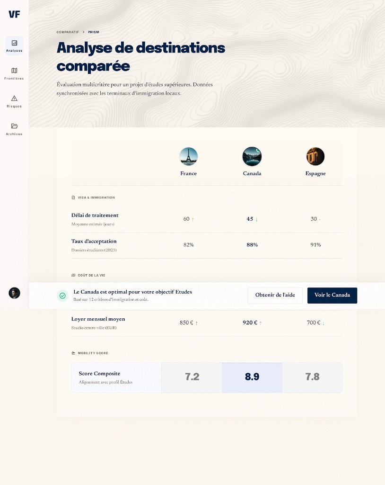

# PAGE 03 — “PRISM”
## Comparer les pays — table d’analyse multi-signaux

### File Name
`03-prism-country-compare.md`

### Page Type
Public

### Related User Journeys
- Arbitrage rationnel 2–4 destinations
- Préparation rendez-vous conseil / délégation service

### Connected Pages
- **Précédent :** `/explorer`, deep links depuis marketing
- **Suivant :** `/countries/[id]`, `/services/delegated-applications`

---

## 1. Page Purpose
La comparaison transforme la **complexité multidimensionnelle** en **tableau lisible** avec sticky context (objectif). Elle résout *“Que choisir objectivement ?”* sans masquer les nuances. Business : pousser vers pays final ou service humain quand la décision reste difficile.

---

## 2. Primary User Actions
- **Primaires :** ajouter / retirer pays ; changer objectif de comparaison ; lire lignes critères.
- **Secondaires :** expand cellules détail ; ouvrir sources officielles.
- **Conversion :** CTA “Obtenir de l’aide” / déléguer (contextuel).

---

## 3. UX Goals
- **Clarté comparative :** alignement vertical strict des métriques.
- **Réduction charge cognitive :** regroupement lignes par familles (visa, coût, risque, qualité de vie).
- **Confiance :** tooltips avec définition + lien provenance.

---

## 4. Layout Architecture
**Route :** `app/(public)/compare/page.tsx` — enveloppe **fond crème** `#FDFBF4` → `PageContainer` + **`Suspense`** (`CompareExperienceSkeleton`) → **`CompareExperience`** (`components/compare/CompareExperience.tsx`, client).

**Maquette Stitch de référence :** capture **`../assets/page-03-prism-stitch-reference.png`** — voir **§4bis**.

**Flux UX code :** assistant en **étapes** `category` → `objective` → `countries` ; jusqu’à **`MAX = 4`** pays (`selectedIds`) ; **`ComparePrismHeader`** (fil d’Ariane *Comparatif › Prism*, titre serif, fond topographique léger) ; table **`CompareTable`** `variant="prism"` → **`ComparePrismTable`** (sections Visa & immigration, Coût de la vie, Mobility score, bandeau recommandation) + vue **`default`** si données enrichies absentes ; **`CompareStickyBar`** `variant="prism"` sur l’étape pays ; pickers **`CountryComparePicker`** ; lib **`compare-objectives`**, **`compare-prism-ui`**, **`explorer-atlas-ui`** (délai visa).

### 4bis. Écart maquette ↔ implémentation (2026-05)
**État code :** page compare en **coque Prism** (crème, typographie marine, cartes blanches étapes 1–2). Tableau principal : **grille** avec vignettes pays, flèches de tendance vs **médiane** de la sélection (délai, score visa principal, loyer indicatif), score composite **0–10** (`composite` / 10). **Rail gauche « VF »** de la capture : non dupliqué dans le corps (**`SitePrimaryNavColumn`** global). **Données** : loyer = **placeholder** stable par `id` (pas de série loyer réelle) ; taux = **score visa** modèle 0–100 du KPI prioritaire (études > travail > affaires > tourisme).

| Zone | Maquette | Code |
|------|-----------|------|
| Tableau classique KPI | — | Toujours disponible si `enrichedCountries` ne suit pas `rows` (repli `variant="default"`) |
| CTA bandeau | *Obtenir de l’aide* + *Voir le pays* | Liens **`/services/delegated-applications`** et **`/countries/[id]`** |

---

## 5. Full Section Breakdown

### 5.1 Query & objectif
- **Param `objective` :** validé contre `COMPARE_OBJECTIVES` ; sinon définition via préférence utilisateur (`userObjectiveSlugToCompareObjectiveId`).
- **Pays :** `parseCompareCountryParam` sur query (ids numériques, max 4).

### 5.2 Navigation par étapes
- **Indicateur :** `stepIndex` ; boutons retour (`ArrowLeft` / `ChevronRight` patterns).
- **Partage :** icône `Share2` + logique URL (voir composant).

### 5.3 `CountryComparePicker`
- **Purpose :** recherche + sélection parmi pays enrichis ; respect plafond 4.

### 5.4 `CompareTable`
- **Purpose :** lignes critères issues `enrichedToCompareRow` / signaux comparables ; groupes visuels selon objectif.
- **Loading :** skeleton aligné sur `CompareExperienceSkeleton`.

### 5.5 `CompareStickyBar`
- **Purpose :** résumé décision + CTA (explorer / reco / copy — suivre implémentation).

### 5.6 Cohérence **PAGE 02**
- **Deep link :** `compareHrefForExplorerPageState` préremplit filtres cohérents entre explorer et compare.

### 5.7 Edge cases
- **Moins de 2 pays avec données :** empty states + liens `ctaExploreHref` / `ctaCompareHref` ; **pays invalide** dans URL → gestion dans effets `useSearchParams`.

### 5.8 Métadonnées route
- **`metadata`** dans `page.tsx` : titre + description orientés objectif d’abord.

---

## 6. UI Design Direction
Esthétique **bloomberg-travel** : table dense mais aérée, typographie tabulaire, séparateurs `border-line` fins. Couleurs de delta **vert / ambre / rouge** sémantiques avec légende.

---

## 7. Interaction Design
Hover ligne : highlight transversal ; click cellule : drawer latéral détail signal ; keyboard navigation par ligne.

---

## 8. Responsive UX
Mobile : mode **cartes empilées** par pays avec sections repliées ; sticky CTA bottom safe-area.

---

## 9. Accessibility
Table : `scope="col"` ; résumé non-visuel en paragraphe avant table ; deltas annoncés textuellement.

---

## 10. Edge Cases & States
- **<2 pays :** placeholder comparatif.
- **Données partielles :** cellule “insuffisant” + tooltip.
- **Erreur :** retry par pays.

---

## 11. User Journey Connections
Entrée depuis explorer avec querystring objectif ; sortie vers pays ou services.

---

## 12. AI DESIGN INSTRUCTIONS FOR STITCH
Designer une **table premium** avec header pays sticky + avatar drapeau circulaire. Introduire **ligne de score composite** visuellement plus forte (fond `primary-soft`). Sticky bottom **glass** avec décision textuelle courte + double CTA (pays gagnant / aide humaine).

---

## 13. Screenshot reference (Stitch)

### Stitch Screenshot Reference — PAGE 03 (PRISM)

*Capture intégrée au dépôt ; écarts → **§4bis**.*
