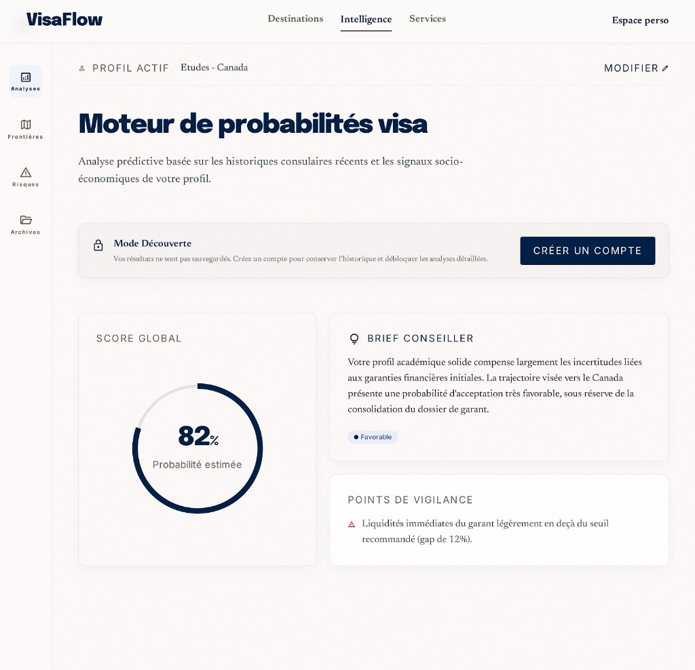

# PAGE 05 — “ORBIT”
## Moteur de probabilités visa — personnalisation du signal

### File Name
`05-orbit-visa-probability-engine.md`

### Page Type
Public (auth modal pour actions réservées)

### Related User Journeys
- Estimation “chances” subjective → signaux
- Incitation création compte après run
- Passage vers recommandations sauvegardées

### Connected Pages
- **Précédent :** navbar, overview
- **Suivant :** `/recommendations`, `/countries/[id]`, Clerk modal

---

## 1. Page Purpose
Le moteur de probabilités **traduit le profil utilisateur** en **lecture probabiliste** (niveaux, narration, radar axes). Il adresse *“Pour moi, ça veut dire quoi ?”* sans promesse légale. Business : activation compte + données profil pour personnalisation.

---

## 2. Primary User Actions
- **Primaires :** saisir / ajuster paramètres profil ; lancer calcul ; lire résultat.
- **Secondaires :** partager (futur) ; exporter PDF (teaser existant patterns).
- **Conversion :** `SignUpButton` modal (« Créer un compte ») pour débloquer sauvegarde / historique ; connexion possible depuis le flux Clerk.

---

## 3. UX Goals
- **Honnêteté cognitive :** disclaimers visibles, vocabulaire non juridique trompeur.
- **Empowerment :** montrer leviers d’amélioration du score.
- **Émotion :** apaisement — éviter alarmisme.

---

## 4. Layout Architecture
**Implémentation actuelle (`app/(public)/probability/page.tsx`) :** coque **Stitch PAGE 05** (fond crème `#FDFBF4`, texte / accents marine `#0D1B3E`) → en-tête titre + sous-titre **serif** → bannière **Mode Découverte** (anonyme) → ligne **Profil actif** (objectif FR + premier pays du classement, lien **Modifier** vers profil ou inscription) → **tableau de bord Orbit** : carte **Score global** (jauge circulaire SVG) + colonne **Brief conseiller** (signaux pays + pastille Favorable / Modéré / Sous réserve) + **Points de vigilance** (première entrée `reasons` ou repli) → liste pays détaillée (expand, comparaison jusqu’à 3) — **pas** de formulaire inline sur cette route (profil via `/api/user/profile` ou **profil démo lecture seule** si anonyme).

### 4bis. Référence visuelle (Stitch)
Alignement maquette : `docs/google-stitch/assets/page-05-orbit-stitch-reference.png`.

---

## 5. Full Section Breakdown

### 5.1 Suspense & chargement
- **Fallback :** `Suspense` avec squelette `DashboardPageSkeleton`, titre Orbit et sous-titre serif (même coque crème que la page).
- **But :** éviter flash vide si `useSearchParams` hydrate lentement.

### 5.2 Profil & API (`POST /api/probability`)
- **Connecté :** `GET /api/user/profile` → corps POST `{ profile, focusCountryId? }`.
- **Anonyme :** `PUBLIC_READ_ONLY_DEMO_PROFILE` + `anonymous_goal_type` si objectif explorateur (`ObjectivePreferenceProvider` / `getObjectiveBySlug`).
- **Erreurs :** toasts (`appToast`) sur échec réseau ou payload non tableau.

### 5.3 Deep links `?countryId=` / `?countryName=`
- **Purpose :** prioriser / auto-expand la ligne pays ciblée après chargement résultats (`useRef` anti double-expand).
- **UX :** bannière “Contexte pays” (accent) quand `countryId` présent.

### 5.4 Bannière mode découverte + Clerk
- **Anonyme :** carte « Mode Découverte » (icône cadenas, copie historique / analyses) + **`SignUpButton` « Créer un compte »** (modal).
- **Alignement PAGE 33** : modal identité sans quitter la page.

### 5.5 Liste résultats & niveaux (`englishScoreLevelToFr`, couleurs `getLevelColor`)
- **Purpose :** rang, score global, chips niveau (Very High → Very Low) cohérents design system.
- **A11y :** ne pas coder la couleur comme seule information — texte niveau visible.

### 5.6 Expansion ligne pays
- **Contenu :** signaux `describeTopCountrySignals`, breakdown `orderedProbabilityBreakdown`, libellés `PROBABILITY_DEFAULT_FIELD_LABELS_FR`, drivers `formatScoreDriversFrench`.
- **Interaction :** chevrons expand/collapse ; contenu dense → scroll interne raisonnable.

### 5.7 Comparaison multi-pays (max 3)
- **CTA :** “Comparer (n)” désactivé si moins de 2 sélections ; toggle affichage panneau comparaison.
- **Journey :** renforce le lien mental vers **PAGE 03** (compare) si deep link futur.

### 5.8 Tableau de bord Orbit (synthèse)
- **Score global :** anneau SVG sur `globalScore` du premier pays du classement.
- **Brief conseiller :** `describeTopCountrySignals(countrySignals)` + pastille d’humeur dérivée de `level` (Favorable / Modéré / Sous réserve).
- **Points de vigilance :** premier élément de `reasons` si présent, sinon texte de repli prudence / consulat.
- **Edge :** résultats vides → CTA profil / explorer / compare avec `ctaExploreHref` / `ctaCompareHref` objectif-aware.

### 5.9 Ligne « Profil actif »
- **Purpose :** rappel compact objectif (`formatGoalTypeLabelFr(goal_type)`) + destination tête de liste ; **Modifier** → `/profile` (connecté) ou `SignUpButton` modal (découverte).

---

## 6. UI Design Direction
Couleur **orbitale** : dégradés radiaux légers derrière graph ; fond carte neutre.

---

## 7. Interaction Design
Animation compteur score (respect reduced motion = instant).

---

## 8. Responsive UX
Graphiques : empilement vertical ; formulaire sections accordion mobile.

---

## 9. Accessibility
Résultats : texte alternatif aux graphiques ; formulaires `aria-describedby` vers disclaimers.

---

## 10. Edge Cases & States
Profil incomplet : CTA disabled + checklist ; erreur serveur : retry ; session expirée : réauth.

---

## 11. User Journey Connections
Vers reco engine pro ; vers pays ciblés.

---

## 12. AI DESIGN INSTRUCTIONS FOR STITCH
Visualiser le score comme **anneau de précision orbital** (cercle fin + gap). Narratif dans **panneau “brief conseiller”** avec icône monoline. Modal auth : **fond flou fort** + carte centrée minimaliste.

---

## 13. Screenshot Placeholder

### Stitch Screenshot Reference

