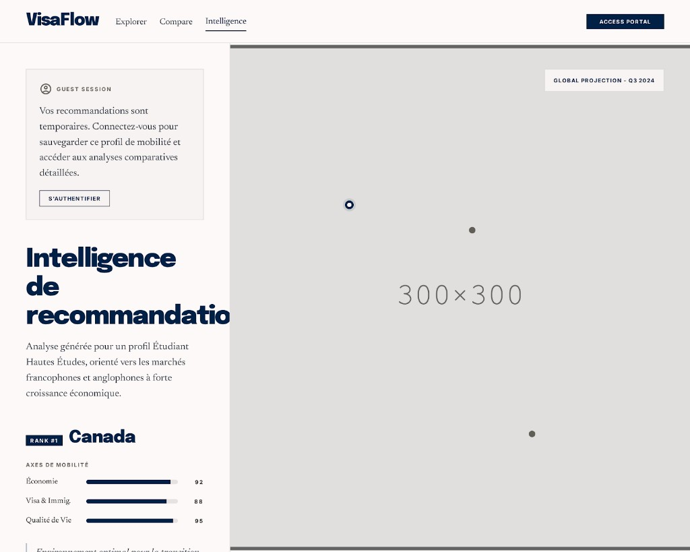

# PAGE 06 — “COMPASS”
## Mes recommandations — carte et liste des destinations suggérées

### File Name
`06-compass-saved-recommendations.md`

### Page Type
Public (gating auth via modal patterns)

### Related User Journeys
- Retour utilisateur après moteur reco
- Exploration géographique des suggestions

### Connected Pages
- **Précédent :** `/probability`, `/recommendation-engine`
- **Suivant :** `/countries/[id]`, auth

---

## 1. Page Purpose
Matérialiser les **résultats moteur** en **vue cartographique + liste** navigable. Résout *“Où est-ce que le système me pousse à regarder ?”* Business : rétention + reclics pays.

---

## 2. Primary User Actions
- **Primaires :** sélectionner point carte ; ouvrir pays.
- **Secondaires :** filtrer par score / région ; trier.
- **Conversion :** `SignInButton` modal (libellé **S'authentifier**) pour persistance profil / analyses détaillées.

---

## 3. UX Goals
- **Orientation spatiale** immédiate.
- **Clarté ranking** sans humiliation des destinations basses.

---

## 4. Layout Architecture
**Implémentation actuelle (`app/(public)/recommendations/page.tsx`) — PAGE 06 Stitch :** coque crème `#FDFBF4` ; **colonne gauche (~1/3)** : carte **Session invité** (icône utilisateur, texte temporaire, bouton outline **S’authentifier** / `SignInButton`) si anonyme ; titre **Intelligence de recommandation** ; paragraphe **serif** dérivé du `goal_type` (`formatGoalTypeLabelFr`) ; puce **Rank #n** + nom pays + `Select` de focus ; bloc **Axes de mobilité** (trois barres horizontales marine sur piste grise : objectif, visa, friction / « qualité de parcours ») ; facteurs clés (`formatScoreDriversFrench`) ; lien fiche pays. **Colonne droite (~2/3)** fond gris `#e8e8e8` : pastille **GLOBAL PROJECTION — Qn YYYY** ; **radar** `ScoreBreakdownChart` (légende axes masquée sur cette vue) avec filigrane décoratif « 300×300 » + points (rappel maquette carte). Sous le split : mode comparaison, grille radars optionnelle, **Classement** avec `RecommendationPanel` **`variant="compass"`** (cartes blanches, barres marine, chip `Rank #k`). **Pas** de carte géo réelle sur cette route.

### 4bis. Référence visuelle
`docs/google-stitch/assets/page-06-compass-stitch-reference.png`

---

## 5. Full Section Breakdown

### 5.1 Suspense & skeleton
- `Suspense` + fallback `DashboardPageSkeleton` sous titre / sous-titre serif (coque crème, marine).

### 5.2 Chargement reco & profil
- **Connecté :** profil `GET /api/user/profile` puis reco (logique équivalente probabilités côté API reco — voir code).
- **Anonyme :** profil démo + carte **Session invité** + `SignInButton` (sans bannière « mode découverte » texte seul héritée).
- **Query `countryId` / `countryName` :** focus pays pour chart / highlight (aligné PAGE 05).

### 5.3 Axes de mobilité (sidebar)
- **Purpose :** trois barres 0–100 (styles Compass, pas `Progress` dégradé) alignées sur `breakdown.goalMatch`, `breakdown.visa`, `breakdown.friction`.

### 5.4 `ScoreBreakdownChart` + sélection pays
- **Purpose :** radar du pays sélectionné dans la **zone grise** droite ; `Select` dans la sidebar synchronise `chartCountryId` / rang affiché.
- **État :** `chartCountryId` ; chargement cohérent avec liste.

### 5.5 `RecommendationPanel` + mode compare
- **Purpose :** lignes mappées via `mapApiRecommendationToPanelRow` ; variante **`compass`** pour PAGE 06 ; toggle **compare** multi-sélection (`compareMode` / `compareSelectedIds`).
- **Empty :** message + liens explorer / compare objectif-aware (`ctaExploreHref`, `ctaCompareHref`).

### 5.6 Drivers & narrative
- **Purpose :** `formatScoreDriversFrench` sur la ligne focus — expliquer “pourquoi” en français court.

### 5.7 Toasts & erreurs réseau
- **Purpose :** feedback non bloquant sur échec fetch / payload invalide.

### 5.8 Écart vs maquette “carte”
- **Note Stitch :** la colonne droite reprend l’**espace carte** (gris + badge projection) mais affiche le **radar** réel ; filigrane « 300×300 » = rappel visuel maquette, pas une carte géographique.

---

## 6. UI Design Direction
Carte **desaturated base** ; pins `primary` ; liste fond `surface`.

---

## 7. Interaction Design
Sync highlight liste ↔ pin ; smooth pan.

---

## 8. Responsive UX
Tabs bottom iOS style pour switch map/liste.

---

## 9. Accessibility
Liste navigable même si carte non utilisable — équivalent textuel ordre reco.

---

## 10. Edge Cases & States
Aucune reco : guide vers probability ; erreur géoloc : fallback liste seule.

---

## 11. User Journey Connections
Boucle vers compare multi picks.

---

## 12. AI DESIGN INSTRUCTIONS FOR STITCH
Carte style **editorial travel print** (peu de labels UI sur la carte). Liste avec **rank chip** (#1, #2). Transition split slider entre carte et liste sur desktop.

---

## 13. Screenshot Placeholder

### Stitch Screenshot Reference

