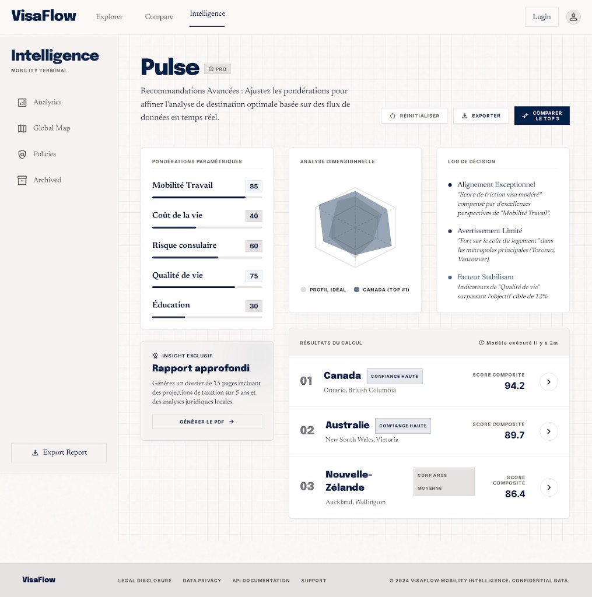

# PAGE 07 — “PULSE”
## Moteur de recommandation (pro) — scoring avancé et breakdown

### File Name
`07-pulse-pro-recommendation-engine.md`

### Page Type
Public (positionné “pro” — densité plus élevée)

### Related User Journeys
- Power users / consultants internes
- Passage reco pro → reco sauvegardées

### Connected Pages
- **Précédent :** `/overview`, `/probability`
- **Suivant :** `/recommendations`, `/compare`

---

## 1. Page Purpose
Offrir une **couche pro** : axes radar, pondérations, signaux détaillés (`RecommendationEnginePage` pattern). Résout *“Pourquoi ce ranking ?”* Business : différenciation premium future.

---

## 2. Primary User Actions
- **Primaires :** ajuster pondérations ; relancer moteur ; inspecter breakdown.
- **Secondaires :** exporter capture (futur).
- **Conversion :** upgrade / compte (placeholder stratégique).

---

## 3. UX Goals
- **Transparence** maximale sur le scoring.
- **Zéro bullshit** : chaque axe relié à données réelles.

---

## 4. Layout Architecture
**Implémentation (`components/recommendation/RecommendationEnginePage.tsx`) — Stitch PAGE 07 :** fond crème `#FDFBF4` + **grille** légère ; en-tête **Pulse** (serif) + badge **Pro** ; barre d’actions **Réinitialiser** (curseurs), **Exporter** (toast placeholder), **Comparer le top 3** → `/compare?objective=…&countries=…` ; bloc repliable **Paramètres d’exécution** (profil playground + **Lancer l’analyse**) ; grille **3 colonnes** : **Pondérations paramétriques** (5 sliders 0–100, défauts maquette), **Analyse dimensionnelle** (`PulseDualRadarChart` : série grise « profil idéal » synthétisée depuis les curseurs vs série marine pays sélectionné + `Select`), **Log de décision** (jusqu’à 3 items depuis `topDrivers` / raisons) ; rangée suivante : carte **Insight exclusif** (PDF placeholder) + **Résultats du calcul** (liste compacte, score composite **local** pondéré, badge confiance, horodatage relatif) ; puis mode comparaison + `RecommendationPanel` **`variant="compass"`**.

### 4bis. Référence visuelle
`docs/google-stitch/assets/page-07-pulse-stitch-reference.png`

---

## 5. Full Section Breakdown

### 5.1 Header “Pro” & contexte
- **Purpose :** titre **Pulse** serif + badge **Pro** (check) ; sous-titre serif aligné maquette.
- **Toolbar :** **Réinitialiser** les pondérations aux défauts Stitch ; **Exporter** → toast « bientôt » ; **Comparer le top 3** → **PAGE 03** `/compare` avec `objective` mappé depuis l’objectif moteur (`TOURISM`→`tourism`, etc.) et IDs des trois premières lignes **après tri pondéré local**.

### 5.2 Panneau pondérations (sliders)
- **Purpose :** Mobilité travail, Coût de la vie, Risque consulaire, Qualité de vie, Éducation — **0–100**.
- **Interactions :** recalcul **instantané côté client** : reclassement `rankedResults` via moyenne pondérée des quatre piliers API (`visa`, `friction`, `100-risk`, `goalMatch`) ; **pas** de re-POST automatique (le POST ne lit pas encore ces poids).

### 5.3 Radar bi-couche (`PulseDualRadarChart`)
- **Purpose :** série grise = **profil idéal** dérivé des curseurs (objet `idealBreakdown` projeté sur les mêmes axes que `breakdownToRadarData`) ; série marine = pays choisi dans le `Select` (libellé légende `Pays (TOP #n)`).

### 5.4 Breakdown chart (`ScoreBreakdownChart`)
- **Purpose :** conservé pour le **mode comparaison** multi-pays (radars empilés sous les cartes principales).

### 5.5 `RecommendationPanel` — liste classée
- **Purpose :** détail des lignes avec `variant="compass"` (PAGE 06) ; cases à cocher si mode comparaison.
- **Interactions :** lien pays via liste « Résultats du calcul » et panneau.

### 5.6 Log de décision
- **Purpose :** jusqu’à 3 puces : titres courts + corps serif italique (drivers FR ou raisons / explications API).

### 5.7 Slot premium / upgrade (placeholder produit)
- **Purpose :** carte **Insight exclusif** ton crème chaud ; CTA **Générer le PDF** → toast placeholder.

### 5.8 Erreurs & timeouts
- **Purpose :** bannière partielle si un pays échoue au fetch ; liste des pays concernés + retry unitaire.

---

## 6. UI Design Direction
Look **terminal analytics** doux : grille de fond 4% opacité ; monospace léger pour valeurs.

---

## 7. Interaction Design
Drag pondération avec snap ; preview instantanée si perf OK sinon debounce.

---

## 8. Responsive UX
Pondérations : bottom sheet ; charts scroll horizontal.

---

## 9. Accessibility
Table breakdown navigable ; radar décrit textuellement.

---

## 10. Edge Cases & States
Pondération invalide : reset ; timeout : partial results banner.

---

## 11. User Journey Connections
Vers compare et pays ; retour overview.

---

## 12. AI DESIGN INSTRUCTIONS FOR STITCH
Introduire **badge “Pro”** métallique discret. Radar **double couche** (profil utilisateur vs destination). Panel latéral **logs de décision** stylisés (non dev) listant top 3 facteurs en langage naturel.

---

## 13. Screenshot Placeholder

### Stitch Screenshot Reference

