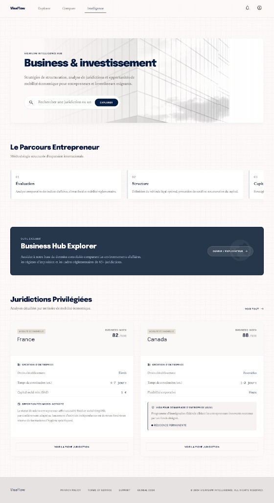

# PAGE 08 — “FORGE”
## Business & mobilité — hub contenus mobilité affaires

### File Name
`08-forge-business-mobility.md`

### Page Type
Public

### Related User Journeys
- Entrepreneur / transfert / réunion
- Passage vers investment ou pays

### Connected Pages
- **Précédent :** sidebar explorer, `/`
- **Suivant :** `/investment`, `/explorer`, `/countries/[id]`

---

## 1. Page Purpose
Agréger **storytelling + liens moteurs** pour l’utilisateur business. Résout *“Quels leviers VisaFlow pour mon activité ?”* Business : positionnement B2B2C futur.

---

## 2. Primary User Actions
- **Primaires :** lire sections ; CTA vers explorer objectif business.
- **Secondaires :** télécharger ressource (futur).

---

## 3. UX Goals
- **Crédibilité** pro (ton sobre, chiffres sourcés).

---

## 4. Layout Architecture
**Implémentation (`app/(public)/business/page.tsx`, client ; `metadata` dans `app/(public)/business/layout.tsx`) — PAGE 08 Stitch :** coque crème `#FDFBF4` + **grille** légère ; **hero** avec photo architecturale (`/images/forge-business-hero.png`, `next/image`), pastille **VisaFlow Intelligence Hub**, titre **Business & investissement**, sous-titre **serif**, barre **recherche** + bouton **Explorer** (`businessHubExplorerHref`) ; section **Le Parcours Entrepreneur** (3 cartes blanches 01–03) ; bannière marine pleine largeur **Business Hub Explorer** (outil exclusif, CTA **Ouvrir l’explorateur**) ; **`GoogleAd slot="business_top"`** ; **Juridictions privilégiées** + lien **Voir tout** ; grille **2 colonnes** pays filtrés : tag beige **Mobilité économique**, **Business index /100**, blocs création d’entreprise / micro-activité, CBI ton **beige** si présent, **`Link` « Voir la fiche juridiction »** → `/countries/[id]`. Données inchangées : `enrichCountryApiRecord`, `visa_system.business`, `street_food`, `cbi_program`.

### 4bis. Référence visuelle
`docs/google-stitch/assets/page-08-forge-stitch-reference.png`

---

## 5. Full Section Breakdown

### 5.1 Chargement
- **`GET /api/countries`** → `normalizeCountriesApiListResponse` ; spinner **marine** si loading.

### 5.2 Carte pays (header)
- **Titre pays** + pastille beige « Mobilité économique » + **Business index** `/100` (`enriched._visa.business`).

### 5.3 Colonnes “Création d’entreprise”
- **Liste :** libellés « Droits d’établissement » / « Mise en place » mappés sur `rights` et `setup` depuis `visa_system.business`.

### 5.4 Colonnes “Micro-activité & food”
- **`street_food` :** opportunité, invest. min, citation `barriers`.

### 5.5 Bloc CBI conditionnel
- **Si `full_data.cbi_program` :** carte verte “Nationalité par investissement”, champs `cost_min`, `time`, `type`.

### 5.6 CTA vers fiche pays
- **Implémentation :** bouton pleine largeur **« Voir la fiche juridiction »** → `/countries/{id}`.

### 5.7 Parcours entrepreneur (storytelling)
- **Trois cartes** fixes (Évaluation, Structure, Capital & mobilité) — contenu éditorial, hors CMS.

---

## 6. UI Design Direction
Stitch **crème / marine** ; pastilles **beige** ; hero **photo architecture** (private-banking mood) ; pictos Lucide discrets.

---

## 7. Interaction Design
Hover encarts : léger zoom image abstraite.

---

## 8. Responsive UX
Colonnes → stack ; CTA full width mobile.

---

## 9. Accessibility
Hiérarchie titres stricte ; liens explicites (“Comparer les pays pour objectif business”).

---

## 10. Edge Cases & States
Données dynamiques absentes : fallback statique.

---

## 11. User Journey Connections
Vers investment CBI ; vers compare.

---

## 12. AI DESIGN INSTRUCTIONS FOR STITCH
Mood **private banking mobility** : photographies abstraites architecture + réseaux. Introduire **ligne temporelle parcours entrepreneur** (4 étapes) comme storytelling horizontal scroll snap.

---

## 13. Screenshot Placeholder

### Stitch Screenshot Reference

