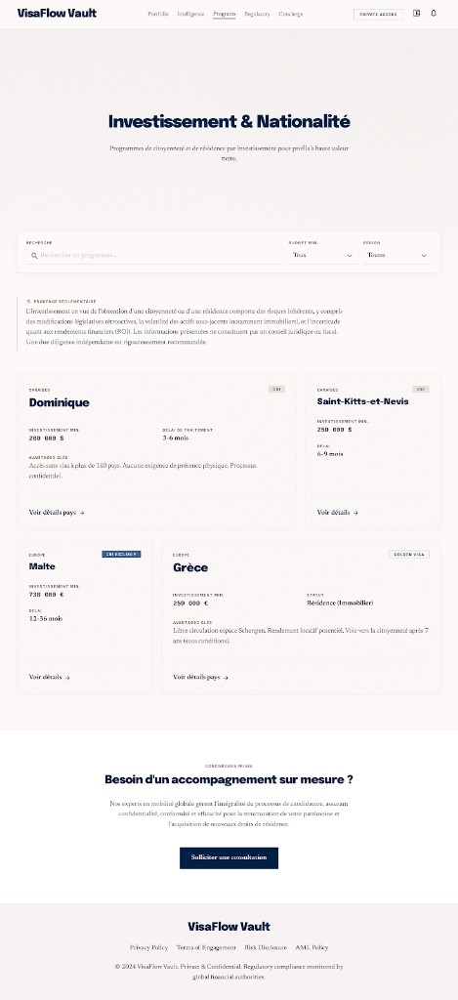

# PAGE 09 — “VAULT”
## Investissement / CBI — programmes citoyenneté par investissement

### File Name
`09-vault-investment-cbi.md`

### Page Type
Public

### Related User Journeys
- HNW individual research
- Passage vers pays ciblés ou services délégués

### Connected Pages
- **Précédent :** `/business`
- **Suivant :** `/countries/[id]`, `/services/delegated-applications`

---

## 1. Page Purpose
Présenter **CBI / golden visa** avec prudence réglementaire + liens données pays. Résout *“Quelles options existent et comment les évaluer ?”* Business : funnel services premium.

---

## 2. Primary User Actions
- **Primaires :** explorer programmes ; filtrer par budget / région.
- **Conversion :** CTA prise de contact / délégation.

---

## 3. UX Goals
- **Transparence risque** (non-promesse ROI).
- **Sobriété** visuelle (prestige calme).

---

## 4. Layout Architecture
**Implémentation (`app/(public)/investment/page.tsx`, client) — PAGE 09 Stitch :** coque crème `#FDFBF4` + **grille** ; hero centré **Investissement & nationalité** + sous-titre **serif** ; **barre blanche** recherche + **`Select`** budget (tranches indicatives USD) + **`Select`** région (valeurs distinctes issues des pays) ; encart **Prudence réglementaire** (`role="note"`, icône info) ; **`GoogleAd slot="investment_top"`** ; grille **1–2 colonnes** de cartes programme : pastille **région** (caps), badge **CBI / CBI EXCLUSIF / GOLDEN VISA** (heuristique `program`), **investissement min.** + **délai ou statut**, bloc **Avantages clés** (serif), lien **Voir détails pays** → `/countries/[id]` ; section **Conciergerie privée** + CTA **`/services/delegated-applications`** ; **`GoogleAd slot="investment_bottom"`**.

### 4bis. Référence visuelle
`docs/google-stitch/assets/page-09-vault-stitch-reference.png`

---

## 5. Full Section Breakdown

### 5.1 Construction `programs`
- **`useMemo` :** parcourt `countries`, garde entrées où `full_data.cbi_program` est un objet ; normalise `cost`, `processing`, `benefits`, `requirements`.

### 5.2 Filtres recherche / budget / région
- **Recherche :** sous-chaîne insensible à la casse sur le nom du pays.
- **Budget :** tranches indicatives sur montant **heuristique** extrait du libellé coût (USD ordre de grandeur) ; entrées non parsables restent visibles dans tous les buckets sauf filtre actif incompatible.
- **Région :** égalité stricte sur `region` / `full_data.region` / `macro_region` du pays.

### 5.3 Carte programme (grille)
- **Header :** région (caps), badge **CBI** / **CBI EXCLUSIF** / **GOLDEN VISA** ; titre pays.
- **Corps :** **Investissement min.** + **Délai de traitement** ou **Statut** ; paragraphe **Avantages clés** (serif).
- **Footer :** lien texte **Voir détails pays** → **`/countries/{id}`**.

### 5.4 Empty state
- **Icône** `Sparkles` + copy dataset incomplet + CTA explorer + tableau de bord.

### 5.5 Disclaimers & risques (produit / Stitch)
- **Bloc** « Prudence réglementaire » sous les filtres (texte serif, ton non-promesse).

### 5.6 Conciergerie
- **CTA** « Solliciter une consultation » → **`/services/delegated-applications`**.

### 5.7 SEO
- **`metadata` :** défini dans `app/(public)/investment/layout.tsx` (titre + description indicative) ; la **page** est `'use client'` sans export metadata.

---

## 6. UI Design Direction
Vault **crème / marine** ; badges discrets ; **serif** pour sous-titres, avantages et disclaimer.

---

## 7. Interaction Design
Accordéons pour conditions ; tooltips juridiques.

---

## 8. Responsive UX
Cartes 1 colonne ; disclaimers sticky bottom mini-bar.

---

## 9. Accessibility
Disclaimers : `role="note"` ; contrastes élevés sur texte légal.

---

## 10. Edge Cases & States
Programme indisponible : badge “à confirmer”.

---

## 11. User Journey Connections
Vers apply délégué “accompagnement dossier”.

---

## 12. AI DESIGN INSTRUCTIONS FOR STITCH
Visuels **abstract gold geometry** (pas de billets photo). Tableau comparatif **comme statement bancaire** — colonnes alignées, typographie tabulaire.

---

## 13. Screenshot Placeholder

### Stitch Screenshot Reference

