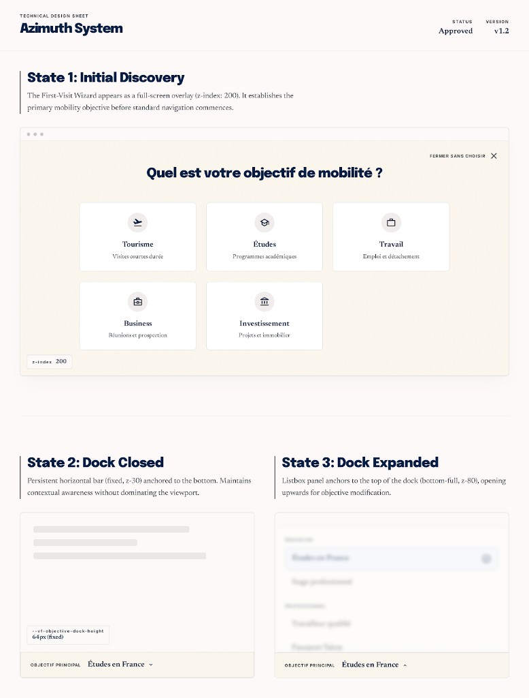

# PAGE 41 — “AZIMUTH”
## Objectif de mobilité global — `AppObjectiveRoot`, wizard premier passage, `SiteObjectiveDock`

### File Name
`41-azimuth-global-mobility-objective.md`

### Page Type
System / Transversal (contexte React + UI dock + overlay wizard)

### Related User Journeys
- Première visite : “pourquoi je suis ici ?” → choix d’objectif (tourisme, travail, études…)
- Retour : changer l’objectif sans refaire tout le parcours — accueil / explorateur / compare **biaisés** par le slug courant

### Connected Pages
- **Montage :** `app/layout.tsx` — **`AppObjectiveRoot`** enveloppe **`SiteChrome`** (**PAGE 34**).
- **Dock & layout :** **`VF_OBJECTIVE_DOCK_HEIGHT_VAR`** (`--vf-objective-dock-height`) — partagé avec padding `main` et position **toasts** (**PAGE 40**).
- **Profil :** slugs alignés `lib/user-objectives/registry` — cohérence **PAGE 24** si objectifs profil croisent ce state.

---

## 1. Page Purpose
Centraliser la spec **produit + technique** de l’**objectif principal** persistant : où il est stocké, comment il se synchronise (local + API utilisateur connecté), comment l’utilisateur le change depuis le dock, et comment le **wizard première visite** s’affiche au-dessus de tout.

---

## 2. Primary User Actions
- **Wizard (si `wizardCompletedAt` absent) :** choisir un objectif dans la grille catégories **ou** fermer sans choisir (`dismissObjectiveWizard`).
- **Dock (après `ready`) :** ouvrir le panneau `DockObjectivePicker` → parcourir groupes (`USER_OBJECTIVE_CATEGORY_ORDER`) → sélectionner un slug → `setPrimaryObjective` (fermeture panneau + persistance).
- **Lecture seule :** libellé courant sous “Objectif principal” ; état chargement = skeleton pulse (`aria-hidden`).

---

## 3. UX Goals
- **Une seule vérité** : `ObjectivePreferenceProvider` — pas de second state objectif concurrent dans les maquettes.
- **Continuité** : copy dock *“L’accueil, l’explorateur et les raccourcis s’alignent sur votre choix.”* (implémentée dans le panneau listbox).
- **Non bloquant après onboarding** : dock compact ; wizard est modal plein écran une seule fois (tant que non complété / non dismiss).

---

## 4. Layout Architecture

### 4.1 `AppObjectiveRoot` (`components/layout/AppObjectiveRoot.tsx`)
- **`ObjectivePreferenceProvider`** enveloppe `children` dans une colonne flex `min-h-0 flex-1`.
- **`FirstVisitObjectiveWizard`** rendu **après** les enfants (sibling) pour empiler au-dessus sans wrapper inutile.

### 4.2 `ObjectivePreferenceProvider`
- **Hydratation :** `readObjectivePreference()` (`lib/objective-preference-storage`) au mount ; écoute événement custom + `storage` pour resync.
- **Clerk :** si `user` chargé → `GET /api/user/profile` pour réconcilier objectif serveur (champs profil) avec le local — détails dans le fichier source.
- **API exposée :** `ready`, `preference`, `primaryDefinition`, `setPrimaryObjective`, `setSecondaryObjectives`, `dismissObjectiveWizard`, `reopenWizard`.

### 4.3 `FirstVisitObjectiveWizard`
- **Visibilité :** `ready && !preference.wizardCompletedAt`.
- **Overlay :** `fixed inset-0 z-[200]`, `role="dialog"`, `aria-modal="true"`, scroll body lock quand visible.
- **Actions :** même grille d’objectifs que le wizard interne ; bouton ✕ “Fermer sans choisir” → `dismissObjectiveWizard`.

### 4.4 `SiteObjectiveDock` (`components/layout/SiteObjectiveDock.tsx`)
- **Position :** `fixed bottom-0 left-0 right-0 z-30` ; **`lg:left-56`** pour laisser place au rail primaire desktop.
- **Mesure hauteur :** `ResizeObserver` sur la section → écrit `document.documentElement.style.setProperty('--vf-objective-dock-height', …)` (minimum **48px**) ; cleanup retire la propriété.
- **Contenu :** `DockObjectivePicker` ; `aria-label="Objectif principal"` sur la `<section>`.

### 4.5 `DockObjectivePicker`
- **Bouton déclencheur :** “Objectif principal” + libellé ou *“Choisir votre objectif…”* ; `aria-expanded` / `aria-haspopup="listbox"`.
- **Panneau :** `role="listbox"`, ancré **`bottom-full`** (s’ouvre vers le haut), `z-[80]`, scroll interne `max-h-[min(60dvh,22rem)]`.
- **Outside click :** `mousedown` sur document ferme le panneau.

---

## 5. Full Section Breakdown

### 5.1 Persistance (`objective-preference-storage`)
- **Purpose :** schéma versionné `StoredObjectivePreferenceV1` (`primarySlug`, `secondarySlugs`, `wizardCompletedAt`).
- **Stitch :** ne pas inventer de clés storage — toute nouvelle étape wizard doit passer par ce module.

### 5.2 Registre métier (`lib/user-objectives/registry`)
- **Purpose :** slugs typés, libellés FR, groupement `listObjectivesGrouped` — source des cartes wizard + entrées listbox.

### 5.3 Impact navigation (rappel produit)
- Objectif influence **CTA** et deep links (ex. compare / explorer — voir **PAGE 02**, **PAGE 03**, **PAGE 01** dans leurs specs respectives).

### 5.4 Z-index relatif
- **Dock** `z-30` ; panneau picker `z-[80]` ; wizard `z-[200]` ; toasts **`z-[100]`** (**PAGE 40**) — le wizard masque toasts si ouvert simultanément (cas rare).

---

## 6. UI Design Direction
Palette dock / wizard alignée **papier chaud** `#fdf8ef` / bordures `border-line` — cohérent avec **PAGE 34** ; pas de dark mode séparé pour ces surfaces sauf décision design system.

---

## 7. Interaction Design
- Wizard : scroll interne carte max-height ; **XS** `items-start` pour éviter rognage en haut fort zoom (**commentaire code**).
- Dock : chevron indique ouverture panneau vers le haut (`rotate-180` quand ouvert).

---

## 8. Responsive UX
Safe-area sur dock (`pl`/`pr`/`pb` avec `env(safe-area-inset-*)`) ; wizard padding top/bottom safe-area.

---

## 9. Accessibility
Wizard titre `aria-labelledby` ; fermeture clavier focusable ; listbox roles cohérents sur picker.

---

## 10. Edge Cases & States
- **`!ready` :** skeleton dock uniquement — pas de flash “Choisir…” avant hydratation locale.
- **Utilisateur connecté avec profil serveur :** merge peut écraser / compléter le local — suivre logique `ObjectivePreferenceProvider`.

---

## 11. User Journey Connections
Conditionne la pertinence perçue des scores et liens sur **PAGE 01–03** ; renforce personnalisation avant **PAGE 24**.

---

## 12. AI DESIGN INSTRUCTIONS FOR STITCH
Trois planches : (1) **wizard** desktop + mobile avec grille objectifs ; (2) **dock fermé** avec libellé long tronqué ; (3) **dock ouvert** listbox au-dessus du contenu avec **ombre** séparant du scroll page.

---

## 13. Screenshot Placeholder

### Stitch Screenshot Reference

---

## 14. Implementation Notes (PAGE 41)

> **Statut implémenté :** PAGE 41 — fiche technique « Azimuth System » montée comme **specimen interne** sous `/admin/azimuth`, en pendant des planches `/admin/rampart` (PAGE 39) et `/admin/flare` (PAGE 40). Le système objectif global lui-même (wizard + dock) reste rendu en runtime via `AppObjectiveRoot` dans `app/layout.tsx` — la fiche ne fait que **documenter visuellement** les trois états attendus.

### 14.1 Specimen `/admin/azimuth`
- **`app/(dashboard)/admin/azimuth/layout.tsx`** — `getAdminUser()` + `redirect('/')`, `robots: { index: false, follow: false }`.
- **`app/(dashboard)/admin/azimuth/page.tsx`** — Server Component (`dynamic = 'force-dynamic'`) en cream `#FAF7EE` avec :
  - **Header** : eyebrow mono `TECHNICAL DESIGN SHEET`, serif `Azimuth System`, et 2 pastilles à droite (`STATUS Approved` + dot émeraude, `VERSION v1.2`).
  - **State 1 — Initial Discovery** : conteneur `rounded-3xl border` avec 3 « dots » de barre titre type macOS, fond `#F5F0E3`, titre serif centré `Quel est votre objectif de mobilité ?`, mini-grille `sm:grid-cols-3` de 5 cartes specimen (`Tourisme`, `Études`, `Travail`, `Business`, `Investissement`) basée sur `USER_OBJECTIVES` (slugs `tourism / studies_master / work / business / investment`), bouton `FERMER SANS CHOISIR ×` mono uppercase top-right, chip mono `z-index 200` bottom-left.
  - **State 2 — Dock Closed** : carte blanche avec 5 barres skeleton, chip mono `--vf-objective-dock-height 64px (fixed)`, et un `DockShell` fermé (eyebrow `OBJECTIF PRINCIPAL`, label `Études en France`, chevron-down).
  - **State 3 — Dock Expanded** : carte blanche avec un mini `listbox` (4 lignes, première sélectionnée au tone accent `#3B7DFF` + dot plein), et un `DockShell` ouvert (chevron-up).
  - **Footer** : sources runtime listées en mono (`AppObjectiveRoot.tsx`, `SiteObjectiveDock.tsx`, `FirstVisitObjectiveWizard.tsx`, `DockObjectivePicker.tsx`) + lien retour `← Citadel Admin Console`.
- **Pas d'instanciation live** : la planche affiche des reproductions visuelles statiques pour éviter de capter le focus / déclencher le wizard global / écrire dans `objective-preference-storage` ; le code de référence est cité en footer.

### 14.2 Navigation
- `app/(dashboard)/admin/page.tsx` — ajout d'un lien d'en-tête `Azimuth · Objectif → /admin/azimuth`, en amont des pastilles `Rampart · Edge Auth` et `Flare · Toasts` (ordre éditorial : `Azimuth → Rampart → Flare`).

### 14.3 Runtime non modifié (volontairement)
- `components/layout/AppObjectiveRoot.tsx`, `components/layout/SiteObjectiveDock.tsx`, `components/objectives/{ObjectivePreferenceProvider,FirstVisitObjectiveWizard,DockObjectivePicker}.tsx` et `lib/user-objectives/registry.ts` restent inchangés : la spec runtime décrite aux §4–§10 est déjà honorée (z-index 200 / 80 / 30, `--vf-objective-dock-height ≥ 48px`, scroll-lock body pendant wizard, listbox `bottom-full`, etc.).
- Toute modification produit (ex. nouveau slug, nouvelle catégorie, copy wizard) doit passer par `lib/user-objectives/registry.ts` puis se refléter dans le specimen — la fiche `/admin/azimuth` joue le rôle de **single source of truth visuelle** pour PR review.
