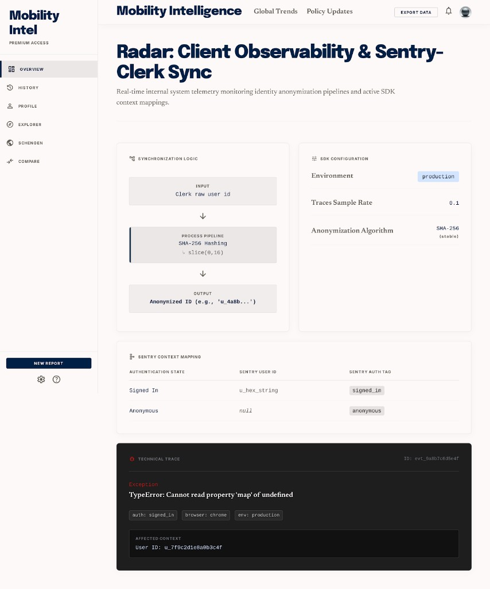

# PAGE 42 — “RADAR”
## Observabilité client — `SentryClerkSync` (contexte utilisateur pseudonyme + tag auth)

### File Name
`42-radar-sentry-clerk-sync.md`

### Page Type
System / Transversal (client, **aucune UI** — `return null`)

### Related User Journeys
- Diagnostiquer erreurs front en production sans exposer PII dans Sentry
- Comparer volume incidents `auth=anonymous` vs `signed_in`

### Connected Pages
- **Montage :** `app/layout.tsx` — **`SentryClerkSync`** rendu dans `<body>` **avant** **`AppObjectiveRoot`** (**PAGE 34**).
- **Identité :** **PAGE 33** (Clerk `useAuth`) ; **PAGE 39** (Edge `proxy.ts` — autre couche, pas ce composant).
- **Erreurs UI :** **PAGE 29–31** (`captureException` dans error boundaries) — **RADAR** enrichit le **contexte** avant/après navigation, pas le flux d’erreur lui-même.

---

## 1. Page Purpose
Documenter **G.90** côté navigateur : après chargement Clerk, attacher à `@sentry/nextjs` un **`user.id` dérivé** (jamais l’identifiant Clerk brut) et un **tag `auth`** pour segmenter les issues — sans aucun rendu visuel.

---

## 2. Primary User Actions
- **Aucune** pour l’utilisateur final.

---

## 3. UX Goals
- **Zéro layout shift** : composant `null`.
- **Confidentialité** : pas d’email, nom, ou `userId` Clerk en clair dans Sentry — seulement préfixe SHA-256 stable (`lib/sentry-anon-user-id.ts`).

---

## 4. Layout Architecture
**Fichier :** `components/SentryClerkSync.tsx`.

**Prérequis runtime :** `process.env.NEXT_PUBLIC_SENTRY_DSN` défini — sinon **early return** : aucun appel Sentry depuis cet effet.

**Séquence :** `useAuth()` → `useEffect` dépend de `[isLoaded, isSignedIn, userId]` → selon état :

| Condition | `Sentry.setUser` | `Sentry.setTag('auth', …)` |
|-----------|------------------|----------------------------|
| DSN absent | *(skip)* | — |
| `!isLoaded` | *(return)* | — |
| `isSignedIn && userId` (async OK) | `{ id: key }` avec `key = await sentryAnonymizedUserKey(userId)` | `signed_in` |
| Idem mais `sentryAnonymizedUserKey` throw / annulé | `null` | `signed_in_unlabeled` |
| Non connecté ou pas d’id | `null` | `anonymous` |

**Cleanup :** flag `cancelled` sur démontage pour éviter setState/SDK après unmount.

---

## 5. Full Section Breakdown

### 5.1 `sentryAnonymizedUserKey(rawUserId)`
- **Algorithme :** `SHA-256` sur l’id brut encodé en UTF-8 → chaîne hexadécimale 64 caractères → **`u_` + `hex.slice(0, 16)`** (16 premiers caractères hex, stable pour groupement d’issues).

### 5.2 Init SDK
- **`sentry.client.config.ts`** : `Sentry.init` si `NEXT_PUBLIC_SENTRY_DSN` — `environment`, `tracesSampleRate` (défaut **0.1** depuis env). Stitch n’a pas à dupliquer ces knobs ; les mentionner pour **ops / design QA** “Sentry actif en preview ?”.

### 5.3 Côté serveur / Edge
- **`sentry.server.config.ts`**, **`sentry.edge.config.ts`** : hors scope visuel Stitch — noter que **RADAR** ne couvre que le **browser SDK** + lien Clerk.

---

## 6. UI Design Direction
Aucun — ne pas placer de mock “badge Sentry” dans les maquettes utilisateur.

---

## 7. Interaction Design
N/A.

---

## 8. Responsive UX
N/A.

---

## 9. Accessibility
N/A (pas de DOM).

---

## 10. Edge Cases & States
- **Clerk lent à hydrater :** tant que `!isLoaded`, pas de tag forcé depuis cet effet (évite flash `anonymous` prématuré ? Actually effect returns early on !isLoaded - so no Sentry update until loaded - good doc).
- **DSN manquant en local :** composant noop — erreurs **PAGE 29** peuvent quand même tenter `captureException` si autre chemin initialise Sentry ; comportement suivre config Sentry officielle.

---

## 11. User Journey Connections
Améliore triage Sentry quand une erreur survient sur **PAGE 16** (client lourd) vs parcours anonyme **PAGE 02**.

---

## 12. AI DESIGN INSTRUCTIONS FOR STITCH
**Exclure** de toute planche utilisateur. Option : **planche technique interne** “Observabilité” listant **RADAR** + **PAGE 39** request id + **PAGE 29–31** capture.

---

## 13. Screenshot Placeholder

### Stitch Screenshot Reference

---

## 14. Implementation Notes (PAGE 42)

> **Statut implémenté :** PAGE 42 — Radar matérialisé en **specimen ops interne** sous `/admin/radar`, en pendant de `/admin/azimuth` (41), `/admin/rampart` (39) et `/admin/flare` (40). Le composant runtime `SentryClerkSync` reste sans UI (`return null`) — Radar n'est qu'un **tableau de bord de contrat** lisible par l'équipe ops/sécurité.

### 14.1 Specimen `/admin/radar`
- **`app/(dashboard)/admin/radar/layout.tsx`** — `getAdminUser()` + `redirect('/')`, `robots: { index: false, follow: false }`.
- **`app/(dashboard)/admin/radar/page.tsx`** — Server Component (`dynamic = 'force-dynamic'`), lit en direct :
  - **DSN status** : pastille verte « DSN actif » / ambre « DSN absent (noop) » dérivée de `NEXT_PUBLIC_SENTRY_DSN`.
  - **Environment** : `NEXT_PUBLIC_VERCEL_ENV ?? VERCEL_ENV ?? NODE_ENV` (pastille bleu accent).
  - **Traces Sample Rate** : `NEXT_PUBLIC_SENTRY_TRACES_SAMPLE_RATE ?? '0.1'`.
  - **Sample anonymized ID** : appelle `sentryAnonymizedUserKey()` côté serveur sur l'`userId` Clerk courant (sinon fallback seed `'demo_anonymous_seed'`). Le rendu utilise le **vrai** algorithme `SHA-256 + slice(0,16)` documenté §5.1.
- Cartes du Stitch reproduites :
  - **Synchronization Logic** (cream panel sub-blocks, accent-soft tint sur l'étape `SHA-256 Hashing`, hint mono `↳ slice(0,16)`, output `Anonymized ID (e.g., 'u_…')`).
  - **SDK Configuration** (Environment pill accent, Traces Sample Rate mono, Anonymization Algorithm `SHA-256 (stable)`).
  - **Sentry Context Mapping** : table 3 colonnes `Authentication State / Sentry User ID / Sentry Auth Tag` avec lignes `Signed In → u_hex_string → signed_in` et `Anonymous → null → anonymous` (et footer citant `components/SentryClerkSync.tsx` + `lib/sentry-anon-user-id.ts`).
  - **Technical Trace** : dark card `#0F141F`, eyebrow rouge `TECHNICAL TRACE`, `ID: evt_…`, exception serif `TypeError: Cannot read property 'map' of undefined`, chips `auth: signed_in`, `browser: chrome`, `env: production`, sous-carte `AFFECTED CONTEXT — User ID: u_…` mono.
- Pas d'instrumentation Sentry réelle déclenchée depuis la page : la trace est un specimen visuel — l'erreur, le tag et l'id correspondent à ce que `captureException` enverrait depuis les error boundaries PAGES 29–31 une fois `SentryClerkSync` monté.

### 14.2 Navigation
- `app/(dashboard)/admin/page.tsx` — header enrichi d'un lien `Radar · Sentry → /admin/radar`, ordre éditorial `Azimuth → Radar → Rampart → Flare`.

### 14.3 Runtime non modifié
- `components/SentryClerkSync.tsx`, `lib/sentry-anon-user-id.ts`, `sentry.client.config.ts` : aucun changement. Le contrat §4 (table de transition `signed_in / signed_in_unlabeled / anonymous`) reste la source de vérité ; la fiche Radar **documente** sans dévier de l'effet runtime, qui demeure `return null`.
