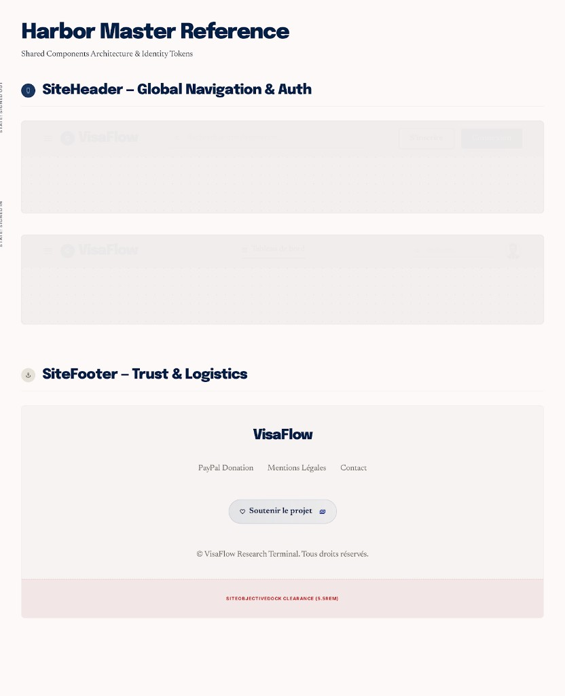

# PAGE 43 — “HARBOR”
## Chrome marketing haut & bas — `SiteHeader`, `SiteFooter` (`components/layout/SiteHeader.tsx`)

### File Name
`43-harbor-site-header-footer.md`

### Page Type
System / Transversal (collé à **PAGE 34** `SiteChrome` — pas des routes dédiées)

### Related User Journeys
- Revenir à l’accueil, ouvrir la navigation primaire, chercher un pays depuis n’importe quelle page publique
- Connexion / inscription / accès tableau de bord
- Soutien projet (lien PayPal) ; lecture copyright

### Connected Pages
- **Parent :** **PAGE 34** (`SiteChrome` — ordre header → toaster → contenu → dock → footer).
- **Auth UI :** **PAGE 33** (`SignInButton` / `SignUpButton` modaux, `UserButton`).
- **Rail navigation :** **PAGE 44** — le **menu burger** du header appelle `onPrimaryNavOpen` pour ouvrir **`SitePrimaryNavColumn`** (parent **PAGE 34**).
- **Dock objectif :** **PAGE 41** — le footer applique un **padding bas** pour ne pas être masqué par le dock.
- **Légal futur :** **PAGE 36** — emplacement naturel pour mentions / confidentialité une fois routées.

---

## 1. Page Purpose
Détailler le **bandeau sticky supérieur** et le **pied de page** partagés par le site : structure responsive, états Clerk, recherche pays globale, et CTA don — afin que Stitch ne redessine pas un header/footer divergents par route.

---

## 2. Primary User Actions
- **Header :** logo → `/` ; menu (si `onPrimaryNavOpen` fourni) ; **`GlobalCountrySearch`** ; Connexion / S’inscrire **ou** Tableau de bord + **UserButton**.
- **Footer :** lire copyright ; ouvrir **PayPal · Don** (`PAYPAL_DONATE_URL`, nouvel onglet `noopener`).

---

## 3. UX Goals
- **Sticky fiable** : `sticky top-0 z-50` sur le `<header>` — le contenu scroll sous la barre sans sauter.
- **Hiérarchie** : zone gauche (menu + marque) vs zone droite (recherche + auth) ; wrap contrôlé (`flex-wrap`, `min-w-0`).
- **Footer calme** : typographie `text-muted` sur le bloc légal ; CTA don distinct (gradient PayPal) sans concurrencer la navigation.

---

## 4. Layout Architecture

### 4.1 `SiteHeader` (`onPrimaryNavOpen?`)
- **Conteneur :** `max-w-[1600px]`, `min-h-16`, `px-4 py-2` → `sm:px-6` → `lg:px-8`.
- **Gauche :** `SiteHeaderMenuButton` **uniquement** si callback présent (pattern `SiteChrome`) ; lien marque **VisaFlow** + icône `Globe` dans pastille `bg-primary`.
- **Droite :** `GlobalCountrySearch` puis bloc auth — `SignedOut` : deux boutons custom wrappant Clerk modal ; `SignedIn` : lien **`/overview`** (`LayoutDashboard` + libellé masqué visuellement en `<380px` via `sr-only`) + **`UserButton`** (`afterSignOutUrl="/"`).

### 4.2 `GlobalCountrySearch` (dans le header)
- **Spec détaillée :** **PAGE 45** — raccourci, dialogue mobile/desktop, API `light=1`, clavier flèches/Entrée.
- **Stitch :** prévoir largeur flexible dans la rangée header ; ne pas écraser les boutons auth sur **sm** étroit.

### 4.3 `SiteFooter`
- **Conteneur :** `max-w-7xl`, centré, `border-t border-line`, fond **`#fdf8ef/90`** aligné header.
- **Padding bas :** `pb-[calc(var(--vf-objective-dock-height,5.5rem)+1.5rem)]` pour laisser le **dock objectif** (**PAGE 41**) et le safe area.
- **Contenu :** copyright dynamique `© {année} VisaFlow` + crédit **JADISS EL ANTAKI** ; lien externe **PayPal · Don** avec `Heart` icon.

---

## 5. Full Section Breakdown

### 5.1 États Clerk dans le header
- **SignedOut :** CTA primaire “Connexion” (fond `primary`), secondaire “S’inscrire” (bordure).
- **SignedIn :** CTA “Tableau de bord” discret + avatar menu Clerk — cohérent avec **PAGE 35** mais visible depuis tout le site public.

### 5.2 Accessibilité header
- Boutons auth explicites `type="button"` ; `title` sur lien overview.
- Recherche : suivre les rôles/combobox du composant dédié (focus trap quand palette ouverte).

### 5.3 Footer & confiance
- Pas encore de liens **PAGE 36** dans le JSX — **Stitch** peut annoter une **rangée future** sous le copyright pour mentions / politique sans casser la grille actuelle.

### 5.4 Z-index relatif
- Header **`z-50`** ; dock **`z-30`** (**PAGE 41**) ; panneau objectif ouvert **`z-[80]`** ; toasts **`z-[100]`** (**PAGE 40**) ; wizard **`z-[200]`** — le header reste sous le wizard mais au-dessus du contenu page standard.

---

## 6. UI Design Direction
Même **papier chaud** `#fdf8ef` + `backdrop-blur` que le dock ; bordures `border-line` ; boutons auth en **uppercase tracking** cohérent avec le ton “outil pro” VisaFlow.

---

## 7. Interaction Design
- Menu mobile : tap ouvre drawer (**PAGE 34** §5.3) — feedback `:hover` sur bouton menu.
- PayPal : `hover:brightness-110` — indiquer ouverture **externe** (icône ou microcopy “ouvre un nouvel onglet” si test utilisateurs).

---

## 8. Responsive UX
- Header : `flex-wrap` avec `gap-y-3` pour empiler recherche + auth proprement sur très petit écran.
- Footer : colonne centrée ; espacement dock déjà géré par CSS var.

---

## 9. Accessibility
- Lien don : `rel="noopener noreferrer"` ; texte bouton explicite “PayPal · Don”.
- `aria-hidden` sur `Heart` décoratif.

---

## 10. Edge Cases & States
- **`SiteHeader` sans `onPrimaryNavOpen` :** pas de bouton menu — rare hors `SiteChrome` ; documenter pour tests isolés.
- **Année copyright :** rendu côté client (`new Date().getFullYear()`) — pas d’impact SEO footer minimal.

---

## 11. User Journey Connections
Point d’entrée global vers **PAGE 16** via recherche ; vers **PAGE 22** via lien connecté ; renforce confiance avant **PAGE 20–21** (services).

---

## 12. AI DESIGN INSTRUCTIONS FOR STITCH
Deux frames **desktop + mobile** : (1) **header** SignedOut et SignedIn côte à côte ; (2) **footer** avec dock **ghost** (rectangle semi-transparent) montrant le **clearance** padding bas.

---

## 13. Screenshot Placeholder

### Stitch Screenshot Reference

---

## 14. Implementation Notes (PAGE 43)

> **Statut implémenté :** PAGE 43 — Harbor matérialisée en **specimen sheet** sous `/admin/harbor`, suivant le pattern des planches `/admin/azimuth` (41), `/admin/radar` (42), `/admin/rampart` (39) et `/admin/flare` (40). Le chrome runtime (`SiteHeader` + `SiteFooter` dans `components/layout/SiteHeader.tsx`) reste **inchangé** — Harbor documente leurs deux états visuels canoniques sans dupliquer la logique.

### 14.1 Specimen `/admin/harbor`
- **`app/(dashboard)/admin/harbor/layout.tsx`** — `getAdminUser()` + `redirect('/')`, `robots: { index: false, follow: false }`.
- **`app/(dashboard)/admin/harbor/page.tsx`** — Server Component (`dynamic = 'force-dynamic'`). Header serif `Harbor Master Reference` + sous-titre *Shared Components Architecture & Identity Tokens*.
- **Section §1 — SiteHeader** : eyebrow rond `Ship` + serif `SiteHeader – Global Navigation & Auth`. Deux specimens empilés avec étiquette d'état pivotée 90° (`State : Signed Out`, `State : Signed In`) :
  - **Signed Out** : menu burger, brand `VisaFlow` + pastille navy `Globe`, recherche ghost-bar, CTAs `Connexion` (filled navy) + `S'inscrire` (outline).
  - **Signed In** : menu burger, brand, recherche ghost-bar, chip `LayoutDashboard · Tableau de bord` + avatar circulaire ring blanc — mirroring `Link href="/overview"` + `UserButton`.
  - Sous chaque header, bande "page" cream `#FBF6E9` avec barres skeleton pour situer le sticky `z-50`.
  - Footnote citant `sticky top-0 z-50`, `max-w-[1600px]`, `#fdf8ef/90` + `backdrop-blur`, et la règle conditionnelle `onPrimaryNavOpen ? <SiteHeaderMenuButton /> : null` (héritée de SiteChrome, PAGE 34).
- **Section §2 — SiteFooter** : eyebrow rond `Anchor` + serif `SiteFooter – Trust & Logistics`. Carte specimen :
  - Bloc cream centré : brand `VisaFlow`, mini-nav `PayPal Donation · Mentions Légales · Contact`, pill `Heart · Soutenir le projet` + chip mono `EXT` (rappel ouverture nouvel onglet), copyright `© VisaFlow Research Terminal. Tous droits réservés.`
  - Bande rose `SITEOBJECTIVEDOCK CLEARANCE (5.5REM)` matérialisant le padding bas dynamique `pb-[calc(var(--vf-objective-dock-height,5.5rem)+1.5rem)]` (lien avec PAGE 41).
  - Footnote citant les attributs PayPal `target="_blank"` + `rel="noopener noreferrer"`.
- **Footer page** : sources runtime (`components/layout/SiteHeader.tsx` + montage `SiteChrome.tsx`) + lien retour `← Citadel Admin Console`.

### 14.2 Navigation
- `app/(dashboard)/admin/page.tsx` — ajout du lien `Harbor · Chrome → /admin/harbor` dans l'en-tête Citadel (ordre éditorial : `Azimuth → Radar → Rampart → Harbor → Flare`).

### 14.3 Runtime non modifié
- Aucune modification de `components/layout/SiteHeader.tsx` ou des composants qu'il importe (`SiteHeaderMenuButton`, `GlobalCountrySearch`, Clerk `SignInButton/SignUpButton/UserButton`, `CookieConsentBanner.openCookiePreferences`, `PAYPAL_DONATE_URL`). Toute évolution produit (nouveau lien légal, nouveau CTA, refonte de l'auth strip) doit donc être faite dans `SiteHeader.tsx` puis re-photographiée dans `/admin/harbor` pour conserver une seule source de vérité visuelle.
