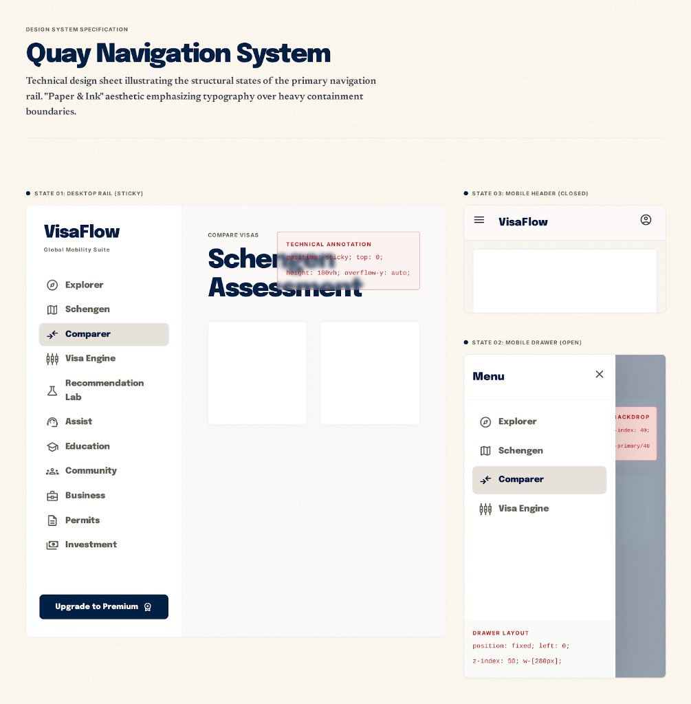

# PAGE 44 — “QUAY”
## Navigation primaire — rail desktop + drawer mobile (`SitePrimaryNavColumn`, `useSitePrimaryNavState`)

### File Name
`44-quay-site-primary-navigation-rail.md`

### Page Type
System / Transversal (composants **`components/layout/SitePrimaryNav.tsx`**)

### Related User Journeys
- Passer d’une grande section produit à l’autre sans repasser par l’accueil
- Sur mobile : ouvrir / fermer le menu latéral depuis le header (**PAGE 43**)

### Connected Pages
- **Parent :** **PAGE 34** (`SiteChrome` — flex `SitePrimaryNavColumn` + `main`).
- **Déclencheur :** **PAGE 43** (`SiteHeaderMenuButton`, `lg:hidden`).
- **Objectif global :** **PAGE 41** — liens **Explorer** et **Comparer** sont **dynamiques** (`ctaExploreHref` / `ctaCompareHref` depuis `preference.primarySlug`).
- **Routes cibles :** **PAGE 02** (Explorer), **PAGE 03** (Comparer), **PAGE 04** (Schengen), **PAGE 05–07**, **PAGE 10**, **PAGE 15**, **PAGE 08**, **PAGE 14**, **PAGE 09**, **PAGE 20** (libellés du rail — aligner specs par PAGE si besoin).

---

## 1. Page Purpose
Spécifier le **menu latéral principal** : liste des entrées, état actif (`aria-current`), comportement **off-canvas** mobile (backdrop, Escape, scroll lock), et cohabitation **sticky** desktop sous le header (`top-16`).

---

## 2. Primary User Actions
- **Desktop (lg+) :** clic lien dans le rail fixe à gauche du `main`.
- **Mobile (<lg) :** ouvrir via burger → tiroir ; fermer via backdrop, bouton ✕, **Escape**, ou navigation ( **`onClick` sur chaque `Link`** appelle `onMobileClose`).

---

## 3. UX Goals
- **Lien actif lisible** : fond `bg-primary-soft`, `text-primary`, `ring-1 ring-primary/25`.
- **Pas de double Schengen** : la liste est construite comme `[Explorer, Schengen, Comparer, …STATIC_LINKS.slice(1)]` — `STATIC_LINKS[0]` (Schengen dupliqué) est **omis** de la slice.
- **Cohérence objectif** : Explorer / Comparer reflètent le slug courant — message aligné **PAGE 41** (dock copy).

---

## 4. Layout Architecture

### 4.1 `useSitePrimaryNavState`
- **State :** `mobileOpen`, `setMobileOpen`, `closeMobile` (`() => setMobileOpen(false)`).
- **Escape global :** `useEffect` écoute `keydown` sur `window` — `Escape` ferme le drawer.

### 4.2 Overlay mobile
- **`fixed inset-0 z-[55]`** — fond `bg-text/40`, léger `backdrop-blur`; `pointer-events-none opacity-0` quand fermé ; `onClick` → `onMobileClose`.

### 4.3 `<aside id="site-primary-nav">`
- **Mobile fermé :** `-translate-x-full` ; ouvert : `translate-x-0`.
- **Largeur tiroir :** `w-[min(19rem,88vw)]`.
- **Desktop :** `lg:sticky lg:top-16 lg:z-0 lg:h-[calc(100dvh-4rem)] lg:w-56` — **aligné hauteur header** `min-h-16` (4rem) ; pas d’ombre latérale en desktop (`lg:shadow-none`).
- **Barre mobile haut aside :** libellé “Menu” + bouton fermer (`aria-label="Fermer le menu"`), **`lg:hidden`**.

### 4.4 Corps `<nav aria-label="Navigation principale">`
- **`usePathname`** + **`isActivePath`** : cas particuliers **Explorer** et **Comparer** (match pathname **sans** querystring vs href qui peut inclure query objectif).
- **Liens :** ordre exact dans le code — **Explorer**, **Schengen**, **Comparer**, puis **Moteur visa**, **Labo reco**, **Assist**, **Éducation**, **Communauté**, **Business**, **Permis**, **Investissement**.

### 4.5 Scroll lock mobile
- Quand `mobileOpen`, `document.documentElement.style.overflow = 'hidden'` ; restauré au cleanup.

---

## 5. Full Section Breakdown

### 5.1 `SiteHeaderMenuButton`
- **Visibilité :** `lg:hidden` — visible seulement mobile / tablette étroite.
- **A11y :** `aria-label="Ouvrir le menu de navigation"`.

### 5.2 Dock & rail
- Le dock objectif (**PAGE 41**) utilise **`lg:left-56`** pour ne pas recouvrir le rail — les deux specs doivent rester synchronisées si largeur rail change.

### 5.3 Z-index (rappel)
- Overlay **`z-[55]`**, aside **`z-[56]`** — au-dessus du **`main`** et, en tiroir ouvert, **au-dessus du header** (`z-50`, **PAGE 43**) : le menu recouvre toute la hauteur viewport.

---

## 6. UI Design Direction
Même fond **papier chaud** `#fdf8ef/95` que header/footer (**PAGE 43**) ; liens **font-black** `text-sm` ; espacement vertical serré `gap-0.5`.

---

## 7. Interaction Design
- Transition drawer : `transition-transform duration-200 ease-out`.
- Hover inactifs : `hover:bg-primary-soft/70 hover:text-primary`.

---

## 8. Responsive UX
- `nav` scroll interne : `min-h-0 flex-1 overflow-y-auto overscroll-y-contain` pour listes longues sur petits écrans.

---

## 9. Accessibility
- `aria-current="page"` sur le lien actif.
- Backdrop : `aria-hidden={!mobileOpen}` quand fermé pour éviter focus fantôme — vérifier ordre focus réel si amélioration future (trap focus non implémenté explicitement dans le snippet actuel).

---

## 10. Edge Cases & States
- **`primarySlug` null :** `ctaExploreHref` / `ctaCompareHref` gèrent le défaut côté `lib/cta-hrefs` — ne pas dupliquer la logique dans Stitch.
- **Path avec query :** matching ignore query pour actif — cohérent sous-pages `/explorer/...` si href de base match.

---

## 11. User Journey Connections
Hub de découverte vers toutes les grandes verticales publiques ; **Assist** mène vers services délégués (**PAGE 20**).

---

## 12. AI DESIGN INSTRUCTIONS FOR STITCH
Trois états **mobile** : fermé (aperçu burger) ; ouvert (tiroir + backdrop) ; **desktop** rail sticky avec un lien actif surligné.

---

## 13. Screenshot Placeholder

### Stitch Screenshot Reference

---

## 14. Implementation Notes (PAGE 44)

> **Statut implémenté :** PAGE 44 — Quay matérialisé en **specimen sheet** sous `/admin/quay`, alignée avec `/admin/azimuth` (41), `/admin/radar` (42), `/admin/harbor` (43), `/admin/rampart` (39), `/admin/flare` (40). Le runtime (`components/layout/SitePrimaryNav.tsx` : `SitePrimaryNavColumn`, `SiteHeaderMenuButton`, `useSitePrimaryNavState`) reste **inchangé** — la planche documente les trois états canoniques sans réécrire la logique.

### 14.1 Specimen `/admin/quay`
- **`app/(dashboard)/admin/quay/layout.tsx`** — `getAdminUser()` + `redirect('/')`, `robots: { index: false, follow: false }`.
- **`app/(dashboard)/admin/quay/page.tsx`** — Server Component (`dynamic = 'force-dynamic'`). Header mono `DESIGN SYSTEM SPECIFICATION` + serif `Quay Navigation System` + sous-titre `Technical design sheet illustrating the structural states of the primary navigation rail.`.
- **Layout 2 colonnes (lg+ `1.7fr / 1fr`)** :
  - **Gauche — State 01 : Desktop Rail (Sticky)** : carte 2-col (rail cream `260px` + stage). Rail VisaFlow + mono `Global Mobility Suite`, 11 items (`Explorer / Schengen / Comparer (active) / Visa Engine / Recommendation Lab / Assist / Education / Community / Business / Permits / Investment`) avec icônes Lucide (`Compass`, `Map`, `ArrowLeftRight`, `Sliders`, `FlaskConical`, `Headphones`, `GraduationCap`, `Users`, `Briefcase`, `FileText`, `Landmark`), bouton CTA navy `Upgrade to Premium · Award`. Stage : eyebrow mono `COMPARE VISAS`, serif `Schengen Assessment`, 2 cartes ghost, et **annotation rose** flottante `TECHNICAL ANNOTATION — position: sticky; top: 0; height: 100vh; overflow-y: auto;`.
  - **Droite — State 03 : Mobile Header (Closed)** : phone-like card avec `Menu` + `VisaFlow` serif + `CircleUserRound` avatar ghost.
  - **Droite — State 02 : Mobile Drawer (Open)** : aside cream `68%` (`Menu` + `X`, 4 items dont `Comparer (active)`) au-dessus d'un backdrop assombri `55%` avec annotation rose `BACKDROP — z-index: 40; bg-primary/40`. Sous la maquette, carte `DRAWER LAYOUT` mono `position: fixed; left: 0; z-index: 50; w-[280px];`.
- **Section `Runtime contract`** (carte blanche) : listing en grille 2-col résumant Z-index (`aside z-[56] / backdrop z-[55] / header z-50 / dock z-30`), classes sticky `lg:sticky lg:top-16 lg:h-[calc(100dvh-4rem)] lg:w-56`, largeur drawer `w-[min(19rem,88vw)]`, liens dynamiques `ctaExploreHref / ctaCompareHref` (PAGE 41), `aria-current="page"` + scroll lock global + `Escape` via `useSitePrimaryNavState`.
- **Pastille rose** en bas de section rappelant la contrainte de cohérence runtime : *« lg:left-56 du dock objectif doit suivre le changement de lg:w-56 du rail »* (cf. PAGE 41).
- **Footer page** : citation `components/layout/SitePrimaryNav.tsx` + lien retour `← Citadel Admin Console`.

### 14.2 Navigation
- `app/(dashboard)/admin/page.tsx` — ajout du lien `Quay · Nav rail → /admin/quay` dans l'en-tête Citadel (ordre éditorial : `Azimuth → Radar → Rampart → Harbor → Quay → Flare`).

### 14.3 Runtime non modifié
- Aucune modification de `components/layout/SitePrimaryNav.tsx` ni de ses dépendances (`ObjectivePreferenceProvider`, `lib/cta-hrefs`). L'ordre exact `[Explorer, Schengen, Comparer, ...STATIC_LINKS.slice(1)]` (Schengen dédupliqué) et la map `isActivePath` (matching pathname sans querystring) restent la source de vérité comportementale ; le specimen ne fait que **photographier** ces décisions pour PR review.
