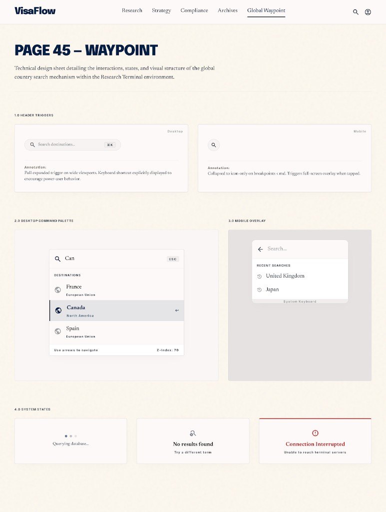

# PAGE 45 — “WAYPOINT”
## Recherche pays globale — palette `GlobalCountrySearch` (`components/nav/GlobalCountrySearch.tsx`)

### File Name
`45-waypoint-global-country-search.md`

### Page Type
System / Transversal (embarqué dans **`SiteHeader`** — **PAGE 43**)

### Related User Journeys
- Atterrir sur une **fiche pays** (**PAGE 16**) depuis n’importe quelle page sans passer par l’explorateur
- Power users : raccourci clavier **⌘K** / **Ctrl+K**

### Connected Pages
- **Montage :** **PAGE 43** (`SiteHeader` — rangée droite avec auth).
- **Destination :** **PAGE 16** — navigation vers **`/countries/{id}`** (`encodeURIComponent` sur l’id).
- **Données :** `GET /api/countries?light=1` + **`normalizeCountriesApiListResponse`** (`lib/country-full-data-materialize`).
- **Layout :** hauteur max du panneau tient compte de **`--vf-objective-dock-height`** (**PAGE 41**) et safe-area.

---

## 1. Page Purpose
Documenter la **command palette** pays : déclencheurs (bouton + raccourci), chargement paresseux de la liste légère, filtrage local, navigation clavier/souris, et différences **mobile plein écran partiel** vs **desktop ancré** sous le bouton.

---

## 2. Primary User Actions
- **Ouvrir / fermer :** clic bouton “Pays” (libellé masqué `<420px` via `sr-only` sur le span texte, icône loupe toujours visible) ; **⌘K** ou **Ctrl+K** (toggle) sauf si **fermé** et focus dans un champ éditable (`isEditableKeyboardTarget` → ne pas intercepter).
- **Rechercher :** saisie dans `<input type="search">` ; filtre **substring** insensible à la casse sur `name`.
- **Choisir :** clic `Link` ou **Entrée** sur la ligne surlignée ; **flèches Haut/Bas** déplacent le surlignage (modulo longueur liste).
- **Fermer :** **Escape** ; clic hors panneau (`mousedown` sur document) ; clic backdrop **mobile** (`fixed inset-0 z-[60]`).

---

## 3. UX Goals
- **Ne pas bloquer le premier paint :** préchargement liste via **`requestIdleCallback`** si dispo, sinon **`setTimeout(500ms)`** ; re-fetch garanti à l’ouverture du dialogue (`useEffect` sur `[open, load]`).
- **Listes courtes par défaut :** sans requête utilisateur → **14** premiers pays ; avec filtre → max **24** résultats.
- **Feedback chargement :** “Chargement…” dans la liste ; vide → “Aucun résultat.”

---

## 4. Layout Architecture

### 4.1 Déclencheur (fermé)
- **Bouton :** `aria-expanded`, `aria-haspopup="dialog"`, `aria-label="Rechercher un pays"`, `title` inclut le raccourci.
- **Raccourci affiché :** `<kbd>` visible **`sm:inline`**, caché sur très petit écran ; libellé plateforme via **`useAppleLikePlatform`** (`⌘K` vs `Ctrl+K`).

### 4.2 Panneau ouvert
- **Mobile :** sous-couche **`z-[60]`** semi-opaque ; dialogue **`fixed`** `left-3 right-3`, `top` sous le header (`max(5rem, …)` + safe-area), **`z-[70]`**, `aria-modal="true"`, `role="dialog"`, `aria-label="Recherche de pays"`.
- **Desktop (`sm:`) :** pas de full-screen overlay liste ; panneau **`absolute`** ancré `right-0` `top-full mt-2`, largeur **`min(100vw-2rem, 22rem)`**, `sm:max-h-[min(70dvh,24rem)]`.

### 4.3 Champ + liste
- Champ avec icône loupe absolue ; placeholder *“Nom du pays…”* ; `autoComplete="off"`.
- **`<ul>` scrollable** avec `max-h` combinant **viewport**, **dock**, **safe-area** (formules dans le TSX — aligner maquettes Stitch sur **petit téléphone + dock visible**).

---

## 5. Full Section Breakdown

### 5.1 Source données
- **Endpoint :** `/api/countries?light=1` — une seule requête réutilisée (`loaded` flag).
- **Normalisation :** mapping `id` + `name` ; filtre entrées sans nom ou sans id valide.

### 5.2 Raccourci global
- **`window` keydown** : `(metaKey || ctrlKey) && key === 'k'` → `preventDefault` + toggle `open`.
- **Interaction avec champs :** si palette **fermée** et cible éditable → laisser passer (saisie Ctrl+K dans un textarea ne doit pas ouvrir la palette).

### 5.3 Focus
- À l’ouverture : `setTimeout(0)` → **`inputRef.focus()`**.

### 5.4 Surlignage (`highlight`)
- Reset implicite : index utilisé avec `Math.min(highlight, filtered.length - 1)` sur **Entrée** ; **ArrowDown/Up** avec modulo.
- **Mouse :** `onMouseEnter` sur ligne met à jour l’index surligné.

---

## 6. UI Design Direction
Ton **outil** : uppercase bouton trigger, `font-mono` sur kbd, liste **font-bold** sur noms pays ; ring sur ligne active cohérent **PAGE 44** (lien actif rail).

---

## 7. Interaction Design
- Toggle **⌘K** : second appui ferme si contexte non éditable ou palette déjà ouverte (toggle explicite dans le handler).

---

## 8. Responsive UX
- Breakpoint **`sm:`** bascule fixed mobile → absolute desktop — vérifier captures **les deux modes**.

---

## 9. Accessibility
- Dialog avec `aria-label` ; bouton trigger label explicite.
- **Limite :** pas de `role="listbox"` / `option` explicite — amélioration possible ; aujourd’hui navigation clavier list + Enter.

---

## 10. Edge Cases & States
- **API en échec :** `rows` vide, `loaded` true → “Aucun résultat.” ou liste vide selon `q`.
- **Très long nom pays :** `block` sur `Link` — prévoir truncate si évolution design.

---

## 11. User Journey Connections
Raccourci critique pour utilisateurs qui enchaînent **PAGE 02** → fiche **PAGE 16** sans souris.

---

## 12. AI DESIGN INSTRUCTIONS FOR STITCH
Quatre frames : trigger **fermé** (mobile vs desktop width) ; dialogue **ouvert** avec liste + surlignage ; état **vide** ; état **chargement**.

---

## 13. Screenshot Placeholder

### Stitch Screenshot Reference

---

## 14. Implementation Notes (PAGE 45)

> **Statut implémenté :** PAGE 45 — Waypoint matérialisé en **specimen sheet** sous `/admin/waypoint`, alignée avec les planches précédentes (`azimuth` / `radar` / `harbor` / `quay` / `rampart` / `flare`). Le runtime (`components/nav/GlobalCountrySearch.tsx`) reste **inchangé** — la planche documente les quatre frames demandés par §12 (déclencheurs desktop/mobile, palette ouverte, états système).

### 14.1 Specimen `/admin/waypoint`
- **`app/(dashboard)/admin/waypoint/layout.tsx`** — `getAdminUser()` + `redirect('/')`, `robots: { index: false, follow: false }`.
- **`app/(dashboard)/admin/waypoint/page.tsx`** — Server Component (`dynamic = 'force-dynamic'`). Cadre principal blanc bordé contenant :
  - **Mock chrome bar** décoratif (VisaFlow + nav `Research / Strategy / Compliance / Archives / Global Waypoint underlined` + `Search` + `CircleUserRound`) — sans interactivité, juste pour situer le contexte Research Terminal.
  - **Hero cream** : serif `PAGE 45 — WAYPOINT` + sous-titre `Technical design sheet detailing the interactions, states, and visual structure of the global country search mechanism within the Research Terminal environment.`.
  - **§1.0 Header Triggers** : 2 cartes blanches (label `Desktop` / `Mobile` mono top-right). Desktop : pill `Search destinations… [⌘K]`. Mobile : bouton rond icône loupe. Chaque carte porte une `Annotation:` paragraphe pédagogique.
  - **§2.0 Desktop Command Palette** (`1.4fr`) : maquette dialog ancré dans une carte cream — champ `Can` + `[ESC]`, mono header `Destinations`, 3 rows `France · Canada (highlighted, navy left rail + ArrowLeft) · Spain`, footer mono `Use arrows to navigate · Z-Index: 70`.
  - **§3.0 Mobile Overlay** (`1fr`) : carte gris doux `#F3F4F6` accueillant un dialog blanc — `ArrowLeft + Search…` + mono `Recent Searches` + 2 lignes (`Clock` + `United Kingdom`, `Japan`). Légende centrée mono `System Keyboard`.
  - **§4.0 System States** : 3 cartes — `Loading` (3 dots dégradés + `Querying database...`), `Empty` (`Telescope` + `No results found` + `Try a different term`), `Error` (filet rouge `inset shadow` + `AlertCircle` rouge + `Connection Interrupted` + `Unable to reach terminal servers`).
  - **Runtime contract** (carte blanche, 2-col) : source données `/api/countries?light=1` + `normalizeCountriesApiListResponse`, préchargement `requestIdleCallback / setTimeout(500ms)`, raccourci `⌘K / Ctrl+K` via `useAppleLikePlatform` (court-circuité si focus sur champ éditable), Z-index `60 / 70` cohérent avec ladder Quay/Harbor/Azimuth/Flare, bornes liste (`14 sans requête`, `max 24 avec filtre substring lowercase`), hauteur max calée sur `--vf-objective-dock-height` + safe-area (PAGE 41).
  - **Footer page** : citation `components/nav/GlobalCountrySearch.tsx` + `lib/country-full-data-materialize.ts` + lien retour `← Citadel Admin Console`.

### 14.2 Navigation
- `app/(dashboard)/admin/page.tsx` — ajout du lien `Waypoint · Search → /admin/waypoint` dans l'en-tête Citadel (ordre éditorial : `Azimuth → Radar → Rampart → Harbor → Quay → Waypoint → Flare`).

### 14.3 Runtime non modifié
- Aucune modification de `components/nav/GlobalCountrySearch.tsx`. Les contrats clavier (`⌘K/Ctrl+K`, `Escape`, ArrowUp/Down modulo, Enter), le re-fetch `useEffect` sur `[open, load]`, l'`autoComplete="off"` du champ et le `setTimeout(0) → inputRef.focus()` à l'ouverture restent la source de vérité — Waypoint en **photographie** simplement les sorties pour PR review.
