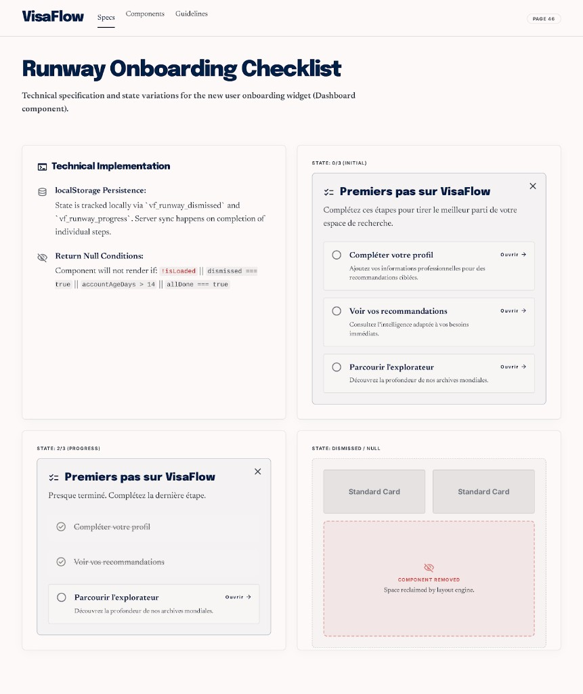

# PAGE 46 — “RUNWAY”
## Checklist premiers pas — `PostSignupOnboarding` (`/overview`)

### File Name
`46-runway-post-signup-onboarding.md`

### Page Type
Dashboard (bloc **optionnel** sur **PAGE 22** — composant **`components/dashboard/PostSignupOnboarding.tsx`**)

### Related User Journeys
- Après inscription : savoir quoi faire en premier (profil → reco → explorateur)
- Réduire l’abandon “compte créé, et après ?”

### Connected Pages
- **Montage :** **`OverviewPageClient`** (**PAGE 22**) — ordre dans la colonne principale après `ObjectivePreferencePanel`.
- **Profil :** **PAGE 24** — étape 1 “Compléter votre profil” (`/profile`) ; complétude via **`GET /api/user/profile`** (revenu, épargne, `goal_type`).
- **Recommandations :** **PAGE 06** — étape 2 marquée **`recoSeen`** depuis `app/(public)/recommendations/page.tsx` (`writeOnboarding` après chargement réussi).
- **Explorateur :** **PAGE 02** — étape 3 **`explorerDone`** via **`markExplorerOnboardingEngaged()`** (actions délibérées : filtres, navigation pays, etc. — voir `explorer/page.tsx`).
- **Objectif global :** **PAGE 41** — liens **Explorer** / astuce **Comparer** utilisent `ctaExploreHref` / `ctaCompareHref` quand `useObjectivePreferenceOptional()` est prêt.

---

## 1. Page Purpose
Spécifier la **carte checklist** “Premiers pas sur VisaFlow” : quand elle apparaît, comment les étapes passent à “fait”, comment l’utilisateur la **masque**, et où la persistance vit (**`localStorage`** `vf_onboarding_v1`).

---

## 2. Primary User Actions
- **Suivre une étape :** lien **“Ouvrir →”** sur les lignes non cochées (`/profile`, `/recommendations`, href explorateur dynamique).
- **Comparer :** lien texte secondaire en bas vers **`compareTipHref`** (objectif-aware).
- **Masquer tout le bloc :** bouton ✕ → **`writeOnboarding({ dismissed: true })`** + resync store.

---

## 3. UX Goals
- **Non intrusif** : dismiss permanent (session storage key côté client jusqu’à reset manuel du storage).
- **Progrès visible** : `CheckCircle2` vert vs `Circle` gris par ligne.
- **Honnêteté produit** : sous-titre indique que le bloc peut être masqué à tout moment.

---

## 4. Layout Architecture
- **Conteneur :** `mb-10`, `rounded-2xl` / `sm:rounded-[2rem]`, `border-primary/30`, `bg-primary-soft/35`, `shadow-card`.
- **En-tête :** `ListChecks` + `h2` “Premiers pas sur VisaFlow” + paragraphe muted ; bouton fermer aligné à droite.
- **Liste :** `<ul>` d’**`<li>`** cartes `border-line/80`, `bg-surface/80` — chaque étape : icône état, titre **font-black**, description, lien conditionnel si `!done`.

---

## 5. Full Section Breakdown

### 5.1 Conditions de **non-affichage** (`return null`)
1. **`!isLoaded`** (Clerk) ou **`!hydrated`** (lecture `localStorage` initiale) ou **`!user`**.
2. **`store.dismissed`** — utilisateur a fermé la checklist.
3. **`!recent && profileOk`** — compte **plus vieux que 21 jours** (`accountIsRecent(createdAt, 21)`) **et** profil API considéré complet → masquer (utilisateurs anciens déjà équipés).
4. **`allDone`** — les trois étapes sont cochées.

### 5.2 Définition “profil complet” (`profileLooksComplete`)
- **`income`** nombre fini **> 0** ; **`savings`** nombre fini ; **`goal_type`** chaîne non vide après trim.
- Erreur payload profil → non complet.

### 5.3 Persistance (`lib/onboarding-storage.ts`)
- **Clé :** `vf_onboarding_v1` (JSON dans `localStorage`).
- **Champs :** `dismissed?`, `explorerDone?`, `recoSeen?`.
- **Événement :** `ONBOARDING_STORAGE_UPDATED_EVENT` — le composant réécoute + `focus`, `storage`, `visibilitychange` pour resync multi-onglets.

### 5.4 Ordre des étapes (figé dans le composant)
| # | Titre | `done` quand | Cible `href` |
|---|--------|----------------|--------------|
| 1 | Compléter votre profil | `profileOk` | `/profile` |
| 2 | Voir vos recommandations | `store.recoSeen` | `/recommendations` |
| 3 | Parcourir l’explorateur | `store.explorerDone` | `explorerStepHref` |

---

## 6. UI Design Direction
Ton **coach** : même famille que **PAGE 22** (cartes dashboard) ; accent `primary` sur bordure externe pour distinguer du reste de l’overview.

---

## 7. Interaction Design
- Clic ✕ : mise à jour synchrone du store + `setStore(readOnboarding())` pour disparition immédiate sans reload.

---

## 8. Responsive UX
- Padding `p-5` → `sm:p-6` ; typographies `text-xs` → `sm:text-sm` sur descriptions.

---

## 9. Accessibility
- Bouton masquer : `aria-label="Masquer la checklist"`.
- Icônes décoratives `aria-hidden` sur `ListChecks` / cercles.

---

## 10. Edge Cases & States
- **`useObjectivePreferenceOptional` absent** (hors provider) : hrefs explorateur / comparateur retombent sur la logique `cta*` avec `null` slug — comportement défini dans **`lib/cta-hrefs`**.
- **Quota `localStorage` :** `writeOnboarding` catch silencieux — checklist peut ne pas se souvenir du dismiss (rare).

---

## 11. User Journey Connections
Pont naturel entre **PAGE 33** (signup) et les **moteurs** (**PAGE 05–07**) via profil + reco + explorer.

---

## 12. AI DESIGN INSTRUCTIONS FOR STITCH
Trois frames : checklist **0/3** ; **2/3** avec une ligne cochée ; état **masqué** (annoter “après ✕” sur wireframe overview).

---

## 13. Screenshot Placeholder

### Stitch Screenshot Reference

---

## 14. Implementation Notes (PAGE 46)

> **Statut implémenté :** PAGE 46 — Runway matérialisé en **specimen sheet** sous `/admin/runway`, aligné avec la collection ops (`azimuth` / `radar` / `harbor` / `quay` / `waypoint` / `rampart` / `flare`). Le runtime (`components/dashboard/PostSignupOnboarding.tsx` + `lib/onboarding-storage.ts`) reste **inchangé** : la planche photographie les 3 états canoniques (`0/3`, `2/3`, `dismissed/null`) sans dupliquer la logique de complétion.

### 14.1 Specimen `/admin/runway`
- **`app/(dashboard)/admin/runway/layout.tsx`** — `getAdminUser()` + `redirect('/')`, `robots: { index: false, follow: false }`.
- **`app/(dashboard)/admin/runway/page.tsx`** — Server Component (`dynamic = 'force-dynamic'`). Cadre blanc bordé + mock chrome bar (`VisaFlow` + nav `Specs (active) / Components / Guidelines` + pill `PAGE 46`).
- **Hero cream** : serif `Runway Onboarding Checklist` + sous-titre technique `Technical specification and state variations for the new user onboarding widget (Dashboard component).`.
- **Grille 2×2** :
  - **Technical Implementation** (carte blanche) — icône `Database` + bullet `localStorage Persistence:` détaillant la clé `vf_onboarding_v1` (champs `dismissed / recoSeen / explorerDone`) et le triple resync (`ONBOARDING_STORAGE_UPDATED_EVENT` + `focus` + `storage` + `visibilitychange`). Bullet `Return Null Conditions:` avec **chips code rouge** `!isLoaded || dismissed === true || accountAgeDays > 21 || allDone === true`, suivi d'une note `profil complet ⇔ income > 0 & savings fini & goal_type trim ≠ ''`.
  - **State : 0/3 (Initial)** — `ChecklistCard` `Premiers pas sur VisaFlow` + sous-titre engageant + 3 lignes non cochées avec lien mono `Ouvrir →`.
  - **State : 2/3 (Progress)** — sous-titre `Presque terminé. Complétez la dernière étape.` ; lignes 1 & 2 strike-through cream + check vert ; ligne 3 active (`inset 0 0 0 1px #0D1B3E`).
  - **State : Dismissed / Null** — 2 placeholders gris `Standard Card` + carte rose dashed `COMPONENT REMOVED · Space reclaimed by layout engine.` (icône `EyeOff` rose).
- **Section `Runtime contract`** (carte blanche) — récapitulatif 2-col : montage (`/overview` après `ObjectivePreferencePanel`), storage helpers, sources de complétion (étape 1 = `GET /api/user/profile`, étape 2 = `recoSeen` depuis `/recommendations`, étape 3 = `markExplorerOnboardingEngaged()`), hrefs objectif-aware via `useObjectivePreferenceOptional() + ctaExploreHref / ctaCompareHref` (PAGE 41), conditions null (`!isLoaded / !hydrated / !user / dismissed / !recent && profileOk (accountIsRecent(createdAt, 21)) / allDone`), a11y (`aria-label="Masquer la checklist"` + icônes `aria-hidden`).
- **Footer page** : citation `components/dashboard/PostSignupOnboarding.tsx` + `lib/onboarding-storage.ts` + lien retour `← Citadel Admin Console`.

> **Note de fidélité Stitch :** la maquette source mentionnait `accountAgeDays > 14`, mais le runtime utilise `accountIsRecent(createdAt, 21)` (cf. §5.1). Le specimen affiche **`> 21`** pour rester aligné sur la vraie condition d'affichage ; toute future bascule devra modifier `components/dashboard/PostSignupOnboarding.tsx` puis la planche.

### 14.2 Navigation
- `app/(dashboard)/admin/page.tsx` — ajout du lien `Runway · Onboarding → /admin/runway` dans l'en-tête Citadel (ordre éditorial : `Azimuth → Radar → Rampart → Harbor → Quay → Waypoint → Runway → Flare`).

### 14.3 Runtime non modifié
- Aucune modification de `components/dashboard/PostSignupOnboarding.tsx`, `lib/onboarding-storage.ts`, ni des sources de complétion (`/profile`, `/recommendations`, `/explorer`). Les 4 conditions `return null` (§5.1) et l'ordre des étapes (§5.4) restent la source de vérité — Runway documente sans dévier.
